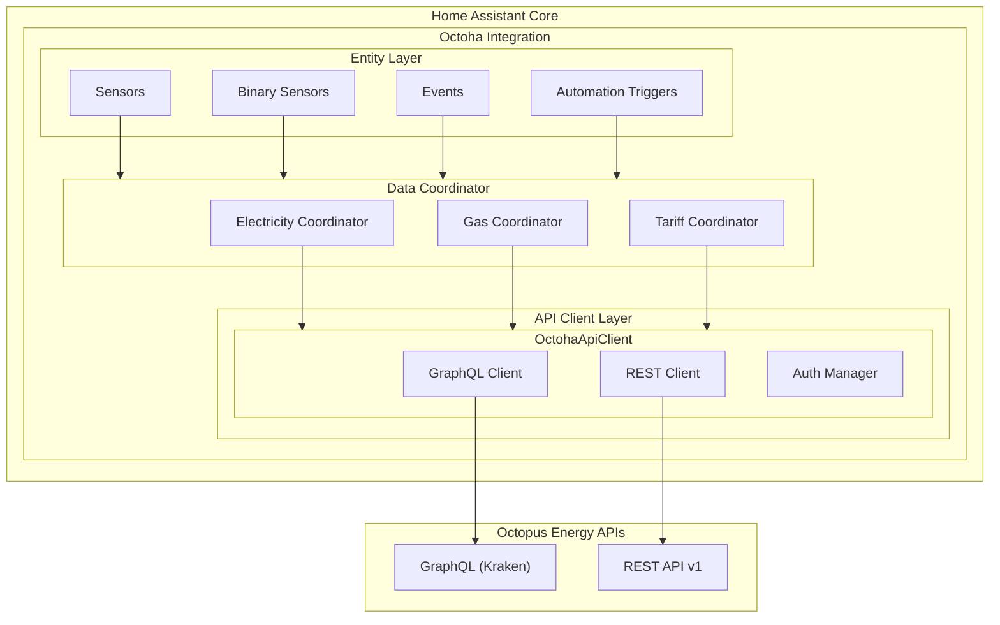

## Status

**Proposed** | Accepted | Rejected | Superseded | Deprecated

## Context

We are building Octoha, a Home Assistant custom integration for Octopus Energy smart meter data. The integration must:

1. **Connect to Octopus Energy APIs** - Both GraphQL (Kraken) and REST APIs are available
2. **Follow HA official patterns** - Config flow, coordinator pattern, entity platform structure
3. **Support reconfiguration** - API key changes without removing the integration
4. **Expose automation-ready entities** - Sensors, triggers, and thresholds for HA automations
5. **Be maintainable** - Clear separation of concerns, testable components

Key technical constraints:

- Octopus API uses GraphQL for real-time data (dispatches, live power, account) and REST for consumption/tariff data
- Smart meter data has 30-min to 24-hour delay depending on data type
- API rate limits require respectful polling (max 1 request/minute per endpoint)
- HA requires async Python (asyncio, aiohttp patterns)

Reference implementation: [open-octopus](https://github.com/abracadabra50/open-octopus) provides proven API patterns using `httpx` async client.

### Open-Octopus Dependency Analysis

A key architectural decision is whether to use open-octopus as a dependency, fork it, or build from scratch. This analysis informs that decision.

#### Open-Octopus Overview

| Attribute    | Value                         |
| ------------ | ----------------------------- |
| Version      | 0.3.0 (released 2025-12-29)   |
| License      | MIT                           |
| Python       | ≥3.10                         |
| Repo Age     | ~3 weeks (created 2025-12-29) |
| Stars        | 30                            |
| Forks        | 4                             |
| Open Issues  | 4                             |
| Commits      | 16                            |
| Contributors | 2                             |

#### Dependencies

```plaintext
Core:
  - httpx>=0.25.0          # Async HTTP client
  - typer>=0.9.0           # CLI framework
  - rich>=13.0.0           # Terminal formatting

Optional (agent):
  - anthropic>=0.30.0      # Claude AI

Optional (menubar):
  - pyobjc-framework-Cocoa>=10.0  # macOS native
```

#### Package Structure

```plaintext
open-octopus/
├── src/open_octopus/
│   ├── __init__.py       # Exports: OctopusClient, models, exceptions
│   ├── client.py         # Core API client (~500 lines) ✓ USEFUL
│   ├── models.py         # Data models (~120 lines) ✓ USEFUL
│   ├── cli.py            # CLI commands ✗ NOT NEEDED
│   ├── tui.py            # Terminal UI ✗ NOT NEEDED
│   ├── agent.py          # Claude AI agent ○ MAYBE (P2)
│   ├── menubar.py        # macOS menu bar ✗ NOT NEEDED
│   ├── menubar_server.py # HTTP server for menubar ✗ NOT NEEDED
│   └── menubar_native.py # Native macOS ✗ NOT NEEDED
├── OctopusMenuBar/       # Swift macOS app ✗ NOT NEEDED
├── OctopusMenuBar.xcodeproj/ ✗ NOT NEEDED
└── tests/                # Test suite ✓ USEFUL as reference
```

#### API Coverage Analysis

| Feature                        | open-octopus | Octoha Needs | Status  |
| ------------------------------ | ------------ | ------------ | ------- |
| GraphQL Auth (token)           | ✓            | ✓            | Covered |
| Account info                   | ✓            | ✓            | Covered |
| Electricity consumption (REST) | ✓            | ✓            | Covered |
| Gas consumption (REST)         | ✓            | ✓            | Covered |
| Electricity tariff             | ✓            | ✓            | Covered |
| Gas tariff                     | ✓            | ✓            | Covered |
| Live power (Home Mini)         | ✓            | ✓            | Covered |
| Intelligent dispatches         | ✓            | ✓            | Covered |
| Completed dispatches           | ✓            | ✓            | Covered |
| Saving sessions                | ✓            | ✓            | Covered |
| Smart devices                  | ✓            | ✓            | Covered |
| Meter discovery                | ✓            | ✓            | Covered |

#### Compatibility Issues with Home Assistant

| Issue                         | Severity | Details                                                                                                               |
| ----------------------------- | -------- | --------------------------------------------------------------------------------------------------------------------- |
| **httpx vs aiohttp**          | Medium   | HA uses `aiohttp` internally; `httpx` adds 2MB+ dependency. Some HA integrations use httpx, but aiohttp is preferred. |
| **No HA session management**  | Medium   | open-octopus creates its own httpx.AsyncClient; HA prefers using `async_get_clientsession()` for connection pooling   |
| **Sync context manager**      | Low      | Uses `async with OctopusClient()` pattern which works but differs from HA coordinator patterns                        |
| **No retry/backoff built-in** | Low      | HA coordinators handle this, but raw client lacks it                                                                  |
| **CLI/TUI dependencies**      | Medium   | `typer` and `rich` are CLI tools, unnecessary for HA integration                                                      |

#### Decision Matrix

| Approach                    | Dev Effort | Maintenance          | Dependencies                 | HA Compliance | Risk                      |
| --------------------------- | ---------- | -------------------- | ---------------------------- | ------------- | ------------------------- |
| **Use as dependency**       | Low        | Low (upstream fixes) | High (+httpx, +typer, +rich) | Medium        | Medium (upstream changes) |
| **Fork & adapt**            | Medium     | High (maintain fork) | Medium (remove CLI deps)     | High          | Low                       |
| **Extract API client only** | Medium     | Medium               | Low (aiohttp only)           | High          | Low                       |
| **Build from scratch**      | High       | Low                  | Low                          | High          | Low                       |

## Decision

We will implement Octoha using a **layered architecture** with clear separation between API client, data coordination, and HA entity layers.

### API Client Strategy: Extract & Adapt (Recommended)

**Decision**: Extract the API client logic from open-octopus and adapt it for Home Assistant, rather than using it as a runtime dependency.

**Rationale**:

1. **Dependency minimisation**: HA integrations should minimise external dependencies. open-octopus brings `httpx`, `typer`, and `rich` - only the HTTP client is needed, and HA provides `aiohttp`.

2. **HA compliance**: Using `async_get_clientsession(hass)` for HTTP calls enables HA's connection pooling, proxy support, and SSL configuration.

3. **Selective extraction**: Only ~600 lines of code are relevant (client.py + models.py). The CLI, TUI, menubar, and agent code (~70% of package) are unnecessary.

4. **Stability**: open-octopus is only 3 weeks old with 16 commits. Taking a dependency on a young, rapidly-changing package introduces risk.

5. **Future flexibility**: Owning the API client allows us to optimise for HA patterns (coordinator integration, error handling, caching).

### What to Extract from open-octopus

| Component                    | Action            | Notes                                            |
| ---------------------------- | ----------------- | ------------------------------------------------ |
| `client.py` GraphQL queries  | **Copy & adapt**  | Rewrite using aiohttp, integrate with HA session |
| `client.py` REST endpoints   | **Copy & adapt**  | Same URLs and auth patterns                      |
| `client.py` Token management | **Copy & adapt**  | Integrate with HA credential storage             |
| `models.py` dataclasses      | **Copy directly** | Clean data models, no changes needed             |
| Exception classes            | **Copy directly** | OctopusError, AuthenticationError, etc.          |
| `agent.py`                   | **Defer to P2**   | Natural language support is Could Have           |
| CLI/TUI/Menubar              | **Ignore**        | Not applicable to HA                             |

### Implementation Approach

```python
# Instead of:
from open_octopus import OctopusClient

# We will create:
from .api import OctohaApiClient  # Our adapted client using aiohttp
```

The API client will:

- Use `aiohttp` via `async_get_clientsession(hass)`
- Store tokens in HA's credential storage
- Follow the same GraphQL/REST patterns as open-octopus
- Be fully tested independently of HA

### Attribution

Since we're extracting patterns from open-octopus (MIT licensed), we will:

1. Include MIT license attribution in our LICENSE file
2. Credit open-octopus in README and code comments
3. Link to the original repository

### Architecture Layers



### Key Design Decisions

#### 1. Dual API Strategy

- **GraphQL API** for: Account info, dispatches, live power, saving sessions, smart devices
- **REST API** for: Consumption data (electricity/gas), tariff rates, historical data
- **Rationale**: Mirrors proven patterns from open-octopus; REST is more stable for consumption data

#### 2. DataUpdateCoordinator Pattern

Use HA's `DataUpdateCoordinator` for each data domain:

| Coordinator              | Update Interval | Data Source    | Entities                                 |
| ------------------------ | --------------- | -------------- | ---------------------------------------- |
| `ElectricityCoordinator` | 5 minutes       | REST API       | Current usage, daily total, historical   |
| `GasCoordinator`         | 5 minutes       | REST API       | Current usage, daily total, historical   |
| `TariffCoordinator`      | 30 minutes      | REST + GraphQL | Rates, standing charge, tariff info      |
| `DispatchCoordinator`    | 5 minutes       | GraphQL        | Intelligent Go slots, EV charging status |
| `LivePowerCoordinator`   | 30 seconds      | GraphQL        | Real-time power (Home Mini only)         |

**Rationale**: Coordinators handle caching, error recovery, and prevent duplicate API calls across entities.

#### 3. Config Flow with Options Flow

```plaintext
Config Flow (Initial Setup):
  └─► API Key entry
      └─► Account validation
          └─► Meter discovery (MPAN/MPRN)
              └─► Entity creation

Options Flow (Reconfiguration):
  └─► Update API Key
  └─► Change polling intervals
  └─► Enable/disable meter types
  └─► Configure thresholds
```

**Rationale**: Supports reconfiguration without removal (FR-307 requirement).

#### 4. Entity Naming Convention

```plaintext
sensor.octoha_{meter_type}_{measurement}

Examples:
  sensor.octoha_electricity_current
  sensor.octoha_electricity_daily
  sensor.octoha_electricity_rate
  sensor.octoha_gas_current
  sensor.octoha_gas_daily
  binary_sensor.octoha_dispatch_active
  sensor.octoha_dispatch_next
```

#### 5. Authentication Strategy

- API key stored in HA credential storage (encrypted)
- GraphQL token obtained via mutation, cached for 55 minutes
- Automatic token refresh before expiry
- Graceful degradation on auth failure (retry with backoff)

### Directory Structure

```plaintext
custom_components/octoha/
├── __init__.py           # Integration setup, coordinator initialization
├── manifest.json         # HA manifest (version, dependencies, etc.)
├── config_flow.py        # Config flow + options flow handlers
├── const.py              # Constants (domains, intervals, defaults)
├── coordinator.py        # DataUpdateCoordinator implementations
├── api/
│   ├── __init__.py
│   ├── client.py         # Main OctohaApiClient
│   ├── graphql.py        # GraphQL query definitions
│   ├── rest.py           # REST API helpers
│   └── auth.py           # Token management
├── models/
│   ├── __init__.py
│   ├── consumption.py    # Consumption data models
│   ├── tariff.py         # Tariff/rate models
│   ├── dispatch.py       # Dispatch/charging models
│   └── account.py        # Account/meter models
├── sensor.py             # Sensor entity definitions
├── binary_sensor.py      # Binary sensor definitions
├── diagnostics.py        # Diagnostics for troubleshooting
├── strings.json          # UI strings
└── translations/
    └── en.json           # English translations
```

## Consequences

### Positive

- **POS-001**: Clear separation of concerns enables independent testing of API client, coordinators, and entities
- **POS-002**: DataUpdateCoordinator pattern provides automatic caching, error handling, and entity refresh
- **POS-003**: Dual API strategy leverages stability of REST for consumption while enabling GraphQL for real-time features
- **POS-004**: Options flow enables reconfiguration without data loss
- **POS-005**: Follows HA best practices, enabling future core integration submission
- **POS-006**: Modular coordinator design allows selective feature enablement (electricity-only, gas-only, etc.)

### Negative

- **NEG-001**: Multiple coordinators increase complexity vs. single coordinator
- **NEG-002**: Dual API (GraphQL + REST) requires maintaining two client implementations
- **NEG-003**: GraphQL API is unofficial and may change without notice
- **NEG-004**: Token refresh logic adds auth complexity

## Alternatives Considered

### Alternative 1: Use open-octopus as Runtime Dependency

- **Description**: Add `open-octopus` to manifest.json requirements and import `OctopusClient` directly
- **Pros**:
  - Minimal development effort
  - Automatic upstream bug fixes
  - Proven, tested API implementation
- **Cons**:
  - Adds unnecessary dependencies (httpx, typer, rich) - ~5MB
  - Uses httpx instead of HA-preferred aiohttp
  - Young package (3 weeks old, 16 commits) - stability risk
  - No control over breaking changes
  - 70% of package code is unused (CLI, TUI, menubar)
- **Rejection Reason**: Dependency overhead and HA compliance concerns outweigh convenience. The useful code (~600 lines) is easily extracted.

### Alternative 2: Fork open-octopus Repository

- **Description**: Fork the entire repository and maintain as separate project
- **Pros**:
  - Full control over codebase
  - Can remove unused components
  - Maintains git history
- **Cons**:
  - Inherits unnecessary Swift/macOS code
  - Must maintain entire repo structure
  - Upstream improvements require manual merge
  - Repo structure not suitable for HA integration
- **Rejection Reason**: Forking brings unnecessary baggage. It's cleaner to extract only what's needed into a purpose-built HA integration.

### Alternative 3: Build API Client from Scratch

- **Description**: Implement API client without referencing open-octopus
- **Pros**:
  - Complete control
  - No licensing concerns
  - Purpose-built for HA
- **Cons**:
  - Duplicates proven work
  - Must discover API patterns independently
  - Higher risk of bugs in API implementation
  - Longer development time
- **Rejection Reason**: open-octopus provides valuable, tested API patterns. Ignoring this reference would waste effort and increase risk.

### Alternative 4: REST API Only

- **Description**: Use only the official REST API, avoiding GraphQL entirely
- **Rejection Reason**: REST API lacks live power, dispatch schedules, saving sessions, and account balance - key features for Intelligent Go users

### Alternative 5: Single Monolithic Coordinator

- **Description**: One coordinator fetching all data types
- **Rejection Reason**: Different data types have different refresh requirements (live power: 30s, tariffs: 1h); single coordinator would either over-poll or under-refresh

### Alternative 6: Polling Without Coordinator

- **Description**: Direct API calls from entities without coordination layer
- **Rejection Reason**: Would result in duplicate API calls, no caching, and violate HA integration patterns

## Implementation Notes

### API Client Extraction Plan

The following components will be extracted from open-octopus v0.3.0 and adapted:

| Source File                 | Extract                    | Adaptation Required        |
| --------------------------- | -------------------------- | -------------------------- |
| `client.py` lines 1-100     | Class structure, auth flow | Replace httpx with aiohttp |
| `client.py` GraphQL queries | All query strings          | None - use verbatim        |
| `client.py` REST methods    | URL patterns, parsing      | Replace httpx with aiohttp |
| `models.py`                 | All dataclasses            | None - use verbatim        |
| Exception classes           | All three                  | None - use verbatim        |

### Key Adaptations

```python
# open-octopus pattern (httpx)
async def _graphql(self, query: str, variables: dict) -> dict:
    resp = await self._http.post(
        GRAPHQL_URL,
        headers={"Authorization": token},
        json={"query": query, "variables": variables}
    )
    resp.raise_for_status()
    return resp.json()

# Octoha adaptation (aiohttp + HA session)
async def _graphql(self, query: str, variables: dict) -> dict:
    session = async_get_clientsession(self.hass)
    async with session.post(
        GRAPHQL_URL,
        headers={"Authorization": token},
        json={"query": query, "variables": variables}
    ) as resp:
        resp.raise_for_status()
        return await resp.json()
```

### General Implementation Notes

- **IMP-001**: Start with electricity consumption only (Phase 1), add gas in Phase 3
- **IMP-002**: Implement comprehensive error handling with user-friendly messages
- **IMP-003**: Add diagnostic data export for troubleshooting (sanitized, no API keys)
- **IMP-004**: Use `aiohttp` via `async_get_clientsession(hass)` for HA compliance
- **IMP-005**: Implement entity attributes with metadata (last_updated, data_source, etc.)
- **IMP-006**: Include open-octopus attribution in LICENSE and README (MIT requirement)

### Migration/Rollout Strategy

1. **Alpha**: Personal HA instance testing with live Octopus account
2. **Beta**: Limited GitHub release for community testing
3. **Stable**: HACS submission and public release

### Success Criteria

- All unit tests pass (API client, coordinators)
- Gas readings match IHD within 24 hours
- Electricity readings accurate within 1 hour
- Zero unhandled exceptions in 7-day operation
- Config flow validates credentials before completion

## References

- **REF-001**: [open-octopus client.py](https://github.com/abracadabra50/open-octopus/blob/main/src/open_octopus/client.py) - API patterns reference
- **REF-002**: [HA Developer Docs - Integration](https://developers.home-assistant.io/docs/creating_integration_manifest)
- **REF-003**: [HA Developer Docs - DataUpdateCoordinator](https://developers.home-assistant.io/docs/integration_fetching_data)
- **REF-004**: [Octopus Energy GraphQL Reference](https://docs.octopus.energy/graphql/reference/)
- **REF-005**: [PRD - Octoha](../PRDs/prd-octoha.md)
