# Octoha Architecture Documentation

> Comprehensive software architecture documentation for the Octoha Home Assistant integration.

## Overview

Octoha is a Home Assistant custom integration for Octopus Energy that provides accurate gas and electricity consumption data, tariff rates, and Intelligent Octopus dispatch management. The integration follows a clean layered architecture with clear separation of concerns.

## Quick Links

- [System Context (C4 Level 1)](#1-system-context-c4-level-1)
- [Container View (C4 Level 2)](#2-container-view-c4-level-2)
- [Component View (C4 Level 3)](#3-component-view-c4-level-3)
- [Data Flow](#4-data-flow)
- [Entity Relationship Diagram](#5-entity-relationship-diagram)
- [State Management](#6-state-management)
- [Error Handling](#7-error-handling)
- [Configuration](#8-configuration)

---

## 1. System Context (C4 Level 1)

The highest-level view showing how Octoha fits into the broader ecosystem.

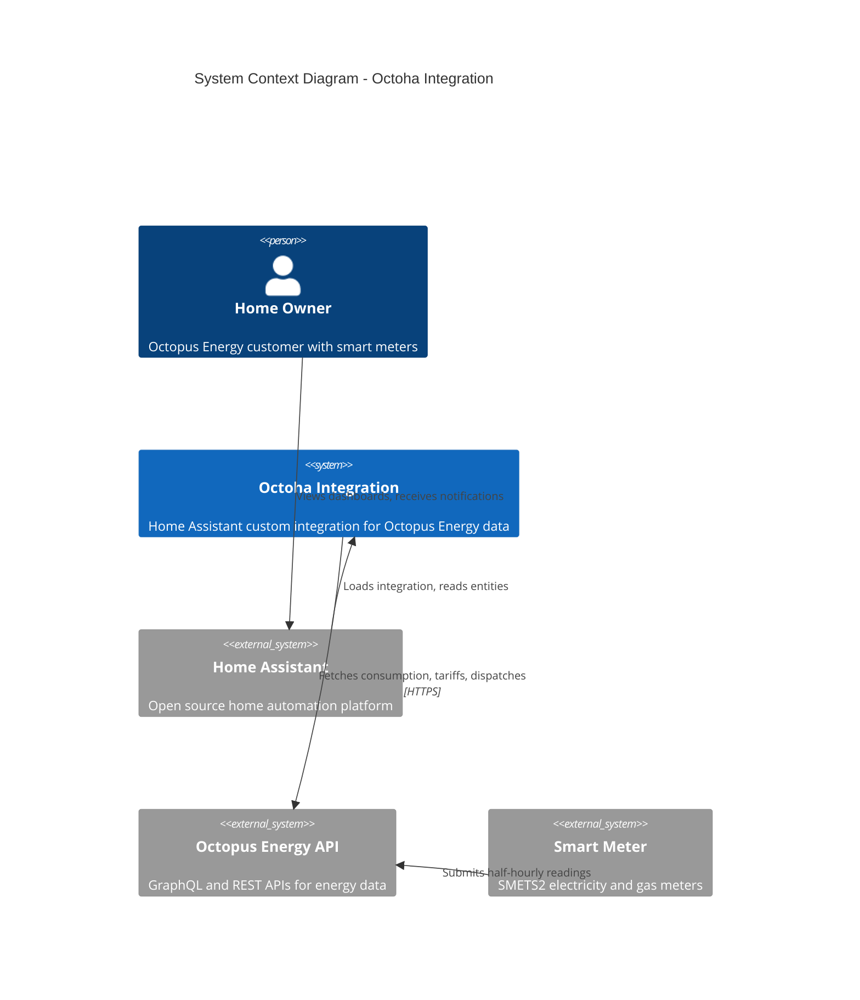
```mermaid
C4Context
    title System Context Diagram - Octoha Integration

    Person(user, "Home Owner", "Octopus Energy customer with smart meters")
    
    System(octoha, "Octoha Integration", "Home Assistant custom integration for Octopus Energy data")
    
    System_Ext(ha, "Home Assistant", "Open source home automation platform")
    System_Ext(octopus_api, "Octopus Energy API", "GraphQL and REST APIs for energy data")
    System_Ext(smart_meter, "Smart Meter", "SMETS2 electricity and gas meters")
    
    Rel(user, ha, "Views dashboards, receives notifications")
    Rel(ha, octoha, "Loads integration, reads entities")
    Rel(octoha, octopus_api, "Fetches consumption, tariffs, dispatches", "HTTPS")
    Rel(smart_meter, octopus_api, "Submits half-hourly readings")
```

### External Systems

| System | Description | Interaction |
|--------|-------------|-------------|
| **Home Assistant** | Core automation platform | Loads Octoha, manages entities, triggers automations |
| **Octopus Energy API** | Data provider | GraphQL for account/dispatch, REST for consumption/tariffs |
| **Smart Meters** | Data source | Submit readings to Octopus (not direct interaction) |

---

## 2. Container View (C4 Level 2)

The major containers (deployable units) that make up the Octoha integration.

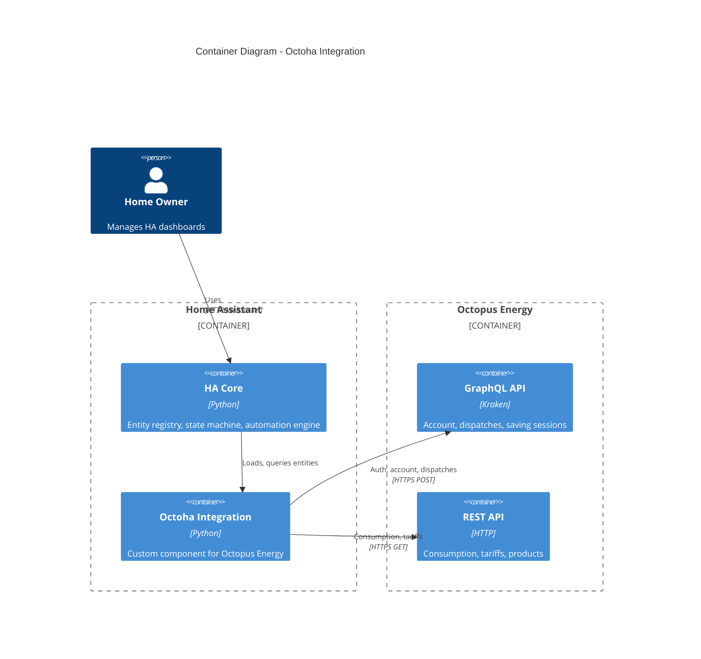
```mermaid
C4Container
    title Container Diagram - Octoha Integration

    Person(user, "Home Owner", "Manages HA dashboards")
    
    Container_Boundary(ha_boundary, "Home Assistant") {
        Container(ha_core, "HA Core", "Python", "Entity registry, state machine, automation engine")
        Container(octoha, "Octoha Integration", "Python", "Custom component for Octopus Energy")
    }
    
    Container_Boundary(octopus_boundary, "Octopus Energy") {
        Container(graphql_api, "GraphQL API", "Kraken", "Account, dispatches, saving sessions")
        Container(rest_api, "REST API", "HTTP", "Consumption, tariffs, products")
    }
    
    Rel(user, ha_core, "Uses", "HTTP/WebSocket")
    Rel(ha_core, octoha, "Loads, queries entities")
    Rel(octoha, graphql_api, "Auth, account, dispatches", "HTTPS POST")
    Rel(octoha, rest_api, "Consumption, tariffs", "HTTPS GET")
```

### Container Responsibilities

| Container | Technology | Responsibility |
|-----------|------------|----------------|
| **HA Core** | Python/asyncio | Entity management, state machine, event bus |
| **Octoha** | Python custom_component | Data fetching, entity creation, event firing |
| **GraphQL API** | Kraken platform | Authentication tokens, account data, dispatch schedules |
| **REST API** | HTTP/JSON | Consumption readings, tariff rates, standing charges |

---

## 3. Component View (C4 Level 3)

Detailed view of the components within the Octoha integration.

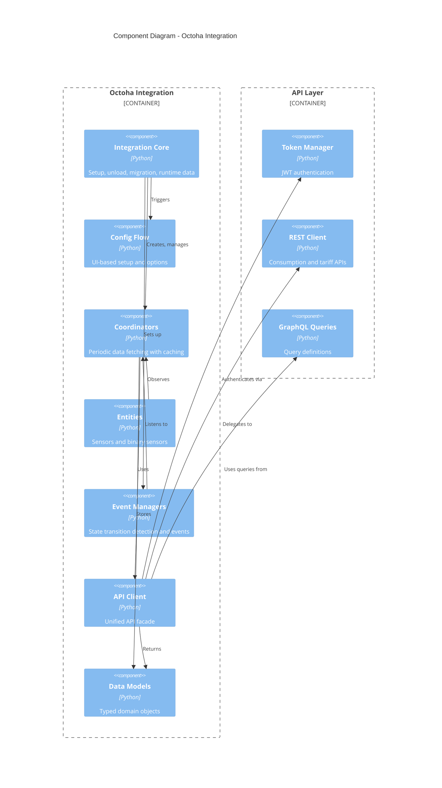
```mermaid
C4Component
    title Component Diagram - Octoha Integration

    Container_Boundary(octoha, "Octoha Integration") {
        Component(init, "Integration Core", "Python", "Setup, unload, migration, runtime data")
        Component(config_flow, "Config Flow", "Python", "UI-based setup and options")
        Component(coordinators, "Coordinators", "Python", "Periodic data fetching with caching")
        Component(entities, "Entities", "Python", "Sensors and binary sensors")
        Component(events, "Event Managers", "Python", "State transition detection and events")
        Component(api_facade, "API Client", "Python", "Unified API facade")
        Component(models, "Data Models", "Python", "Typed domain objects")
    }
    
    Container_Boundary(api_layer, "API Layer") {
        Component(token_mgr, "Token Manager", "Python", "JWT authentication")
        Component(rest_client, "REST Client", "Python", "Consumption and tariff APIs")
        Component(graphql, "GraphQL Queries", "Python", "Query definitions")
    }
    
    Rel(init, config_flow, "Triggers")
    Rel(init, coordinators, "Creates, manages")
    Rel(init, events, "Sets up")
    Rel(coordinators, api_facade, "Uses")
    Rel(entities, coordinators, "Observes")
    Rel(events, coordinators, "Listens to")
    Rel(api_facade, token_mgr, "Authenticates via")
    Rel(api_facade, rest_client, "Delegates to")
    Rel(api_facade, graphql, "Uses queries from")
    Rel(api_facade, models, "Returns")
    Rel(coordinators, models, "Stores")
```

### Component Details

#### Core Components

| Component | File | Responsibility |
|-----------|------|----------------|
| **Integration Core** | `__init__.py` | Entry point, lifecycle management, runtime data |
| **Config Flow** | `config_flow.py` | User setup wizard, options configuration |
| **Coordinators** | `coordinator.py` | Periodic data refresh, failure tracking |
| **Entities** | `sensor.py`, `binary_sensor.py` | HA entity implementations |
| **Event Managers** | `events.py` | Off-peak and dispatch event firing |

#### API Layer

| Component | File | Responsibility |
|-----------|------|----------------|
| **API Client** | `api/client.py` | Facade for all API operations |
| **Token Manager** | `api/auth.py` | JWT token lifecycle |
| **REST Client** | `api/rest.py` | Consumption and tariff endpoints |
| **GraphQL Queries** | `api/graphql.py` | Query string definitions |
| **Exceptions** | `api/exceptions.py` | Error types and validation |

#### Data Models

| Model | File | Purpose |
|-------|------|---------|
| **Account** | `models/account.py` | Customer, meters, agreements |
| **Consumption** | `models/consumption.py` | Usage readings |
| **Tariff** | `models/tariff.py` | Rates, time windows |
| **Dispatch** | `models/dispatch.py` | Intelligent charging |

---

## 4. Data Flow

### 4.1 Integration Setup Flow

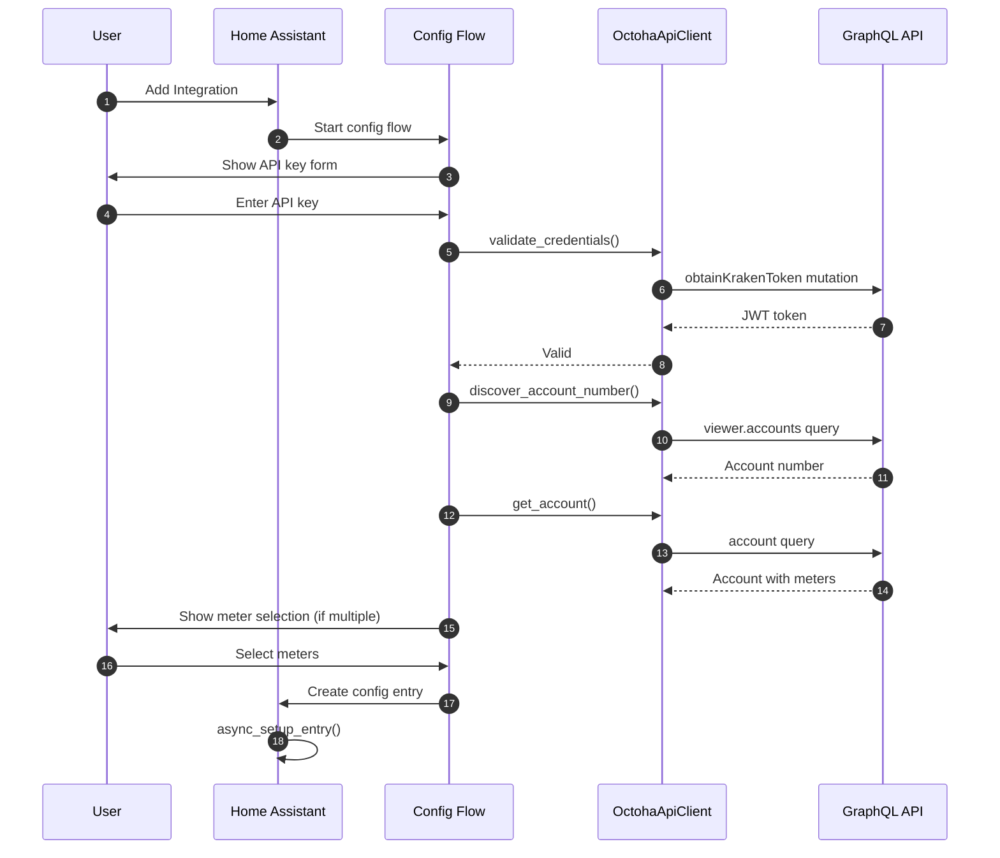
```mermaid
sequenceDiagram
    autonumber
    participant User
    participant HA as Home Assistant
    participant CF as Config Flow
    participant API as OctohaApiClient
    participant GQL as GraphQL API
    
    User->>HA: Add Integration
    HA->>CF: Start config flow
    CF->>User: Show API key form
    User->>CF: Enter API key
    CF->>API: validate_credentials()
    API->>GQL: obtainKrakenToken mutation
    GQL-->>API: JWT token
    API-->>CF: Valid
    CF->>API: discover_account_number()
    API->>GQL: viewer.accounts query
    GQL-->>API: Account number
    CF->>API: get_account()
    API->>GQL: account query
    GQL-->>API: Account with meters
    CF->>User: Show meter selection (if multiple)
    User->>CF: Select meters
    CF->>HA: Create config entry
    HA->>HA: async_setup_entry()
```

### 4.2 Data Refresh Flow

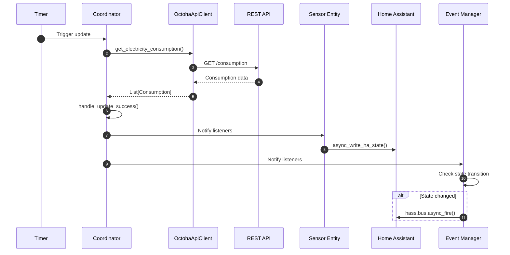
```mermaid
sequenceDiagram
    autonumber
    participant Timer
    participant Coord as Coordinator
    participant API as OctohaApiClient
    participant REST as REST API
    participant Entity as Sensor Entity
    participant HA as Home Assistant
    participant Event as Event Manager
    
    Timer->>Coord: Trigger update
    Coord->>API: get_electricity_consumption()
    API->>REST: GET /consumption
    REST-->>API: Consumption data
    API-->>Coord: List[Consumption]
    Coord->>Coord: _handle_update_success()
    Coord->>Entity: Notify listeners
    Entity->>HA: async_write_ha_state()
    Coord->>Event: Notify listeners
    Event->>Event: Check state transition
    alt State changed
        Event->>HA: hass.bus.async_fire()
    end
```

### 4.3 Authentication Flow

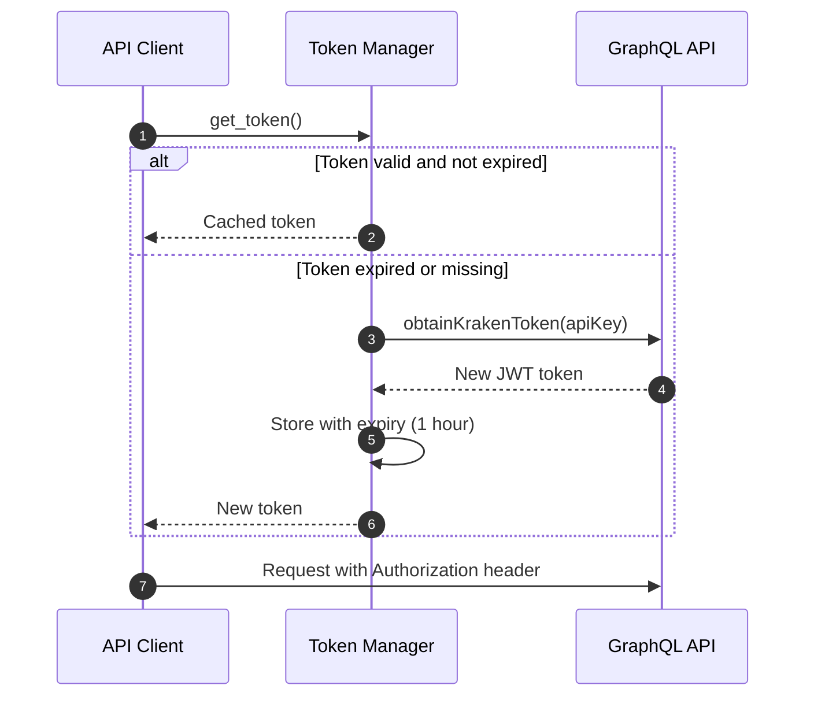
```mermaid
sequenceDiagram
    autonumber
    participant Client as API Client
    participant TM as Token Manager
    participant GQL as GraphQL API
    
    Client->>TM: get_token()
    alt Token valid and not expired
        TM-->>Client: Cached token
    else Token expired or missing
        TM->>GQL: obtainKrakenToken(apiKey)
        GQL-->>TM: New JWT token
        TM->>TM: Store with expiry (1 hour)
        TM-->>Client: New token
    end
    Client->>GQL: Request with Authorization header
```

### 4.4 Graceful Degradation Flow

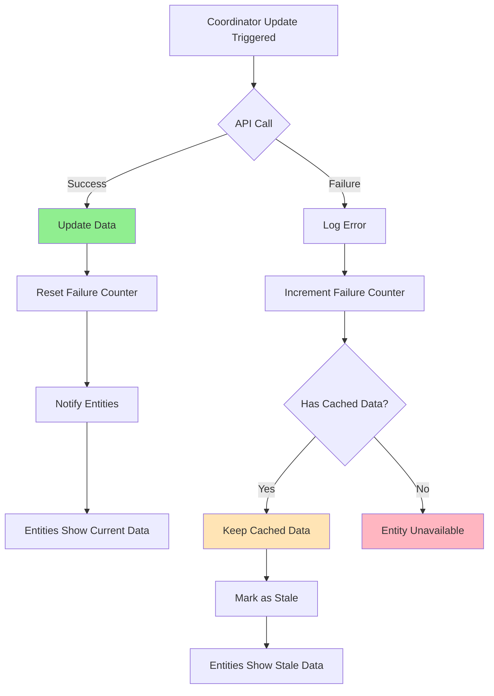
```mermaid
flowchart TD
    A[Coordinator Update Triggered] --> B{API Call}
    B -->|Success| C[Update Data]
    C --> D[Reset Failure Counter]
    D --> E[Notify Entities]
    E --> F[Entities Show Current Data]
    
    B -->|Failure| G[Log Error]
    G --> H[Increment Failure Counter]
    H --> I{Has Cached Data?}
    I -->|Yes| J[Keep Cached Data]
    J --> K[Mark as Stale]
    K --> L[Entities Show Stale Data]
    
    I -->|No| M[Entity Unavailable]
    
    style C fill:#90EE90
    style J fill:#FFE4B5
    style M fill:#FFB6C1
```

---

## 5. Entity Relationship Diagram

### 5.1 Domain Model

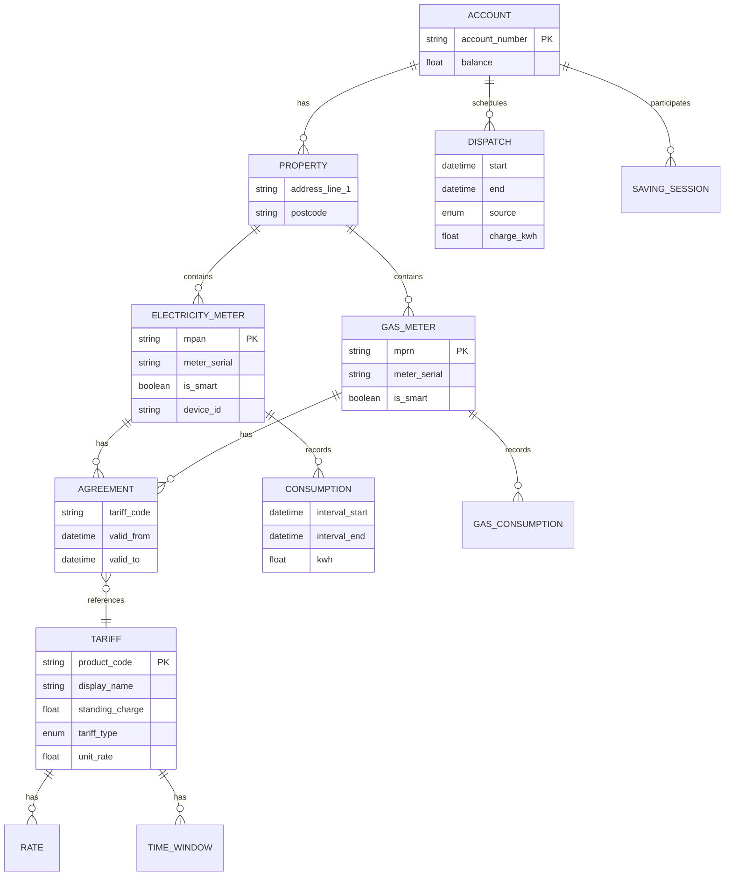
```mermaid
erDiagram
    ACCOUNT ||--o{ PROPERTY : has
    PROPERTY ||--o{ ELECTRICITY_METER : contains
    PROPERTY ||--o{ GAS_METER : contains
    ELECTRICITY_METER ||--o{ AGREEMENT : has
    GAS_METER ||--o{ AGREEMENT : has
    ELECTRICITY_METER ||--o{ CONSUMPTION : records
    GAS_METER ||--o{ GAS_CONSUMPTION : records
    AGREEMENT }o--|| TARIFF : references
    TARIFF ||--o{ RATE : has
    TARIFF ||--o{ TIME_WINDOW : has
    ACCOUNT ||--o{ DISPATCH : schedules
    ACCOUNT ||--o{ SAVING_SESSION : participates
    
    ACCOUNT {
        string account_number PK
        float balance
    }
    
    PROPERTY {
        string address_line_1
        string postcode
    }
    
    ELECTRICITY_METER {
        string mpan PK
        string meter_serial
        boolean is_smart
        string device_id
    }
    
    GAS_METER {
        string mprn PK
        string meter_serial
        boolean is_smart
    }
    
    AGREEMENT {
        string tariff_code
        datetime valid_from
        datetime valid_to
    }
    
    TARIFF {
        string product_code PK
        string display_name
        float standing_charge
        enum tariff_type
        float unit_rate
    }
    
    CONSUMPTION {
        datetime interval_start
        datetime interval_end
        float kwh
    }
    
    DISPATCH {
        datetime start
        datetime end
        enum source
        float charge_kwh
    }
```

### 5.2 Runtime Data Structure

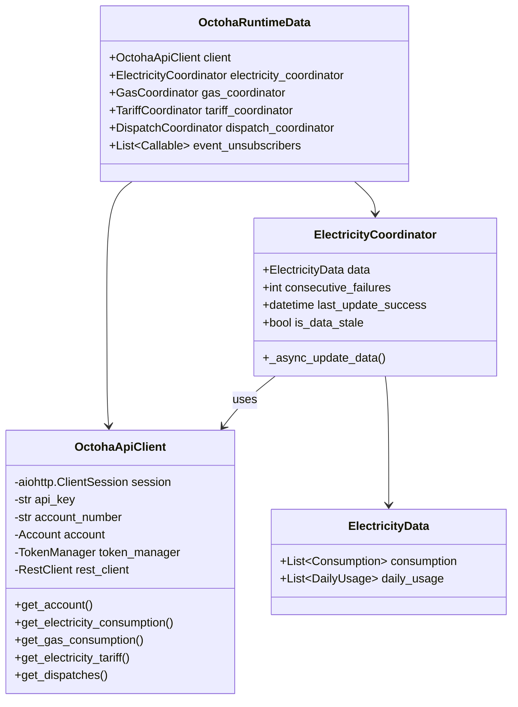
```mermaid
classDiagram
    class OctohaRuntimeData {
        +OctohaApiClient client
        +ElectricityCoordinator electricity_coordinator
        +GasCoordinator gas_coordinator
        +TariffCoordinator tariff_coordinator
        +DispatchCoordinator dispatch_coordinator
        +List~Callable~ event_unsubscribers
    }
    
    class OctohaApiClient {
        -aiohttp.ClientSession session
        -str api_key
        -str account_number
        -Account account
        -TokenManager token_manager
        -RestClient rest_client
        +get_account()
        +get_electricity_consumption()
        +get_gas_consumption()
        +get_electricity_tariff()
        +get_dispatches()
    }
    
    class ElectricityCoordinator {
        +ElectricityData data
        +int consecutive_failures
        +datetime last_update_success
        +bool is_data_stale
        +_async_update_data()
    }
    
    class ElectricityData {
        +List~Consumption~ consumption
        +List~DailyUsage~ daily_usage
    }
    
    OctohaRuntimeData --> OctohaApiClient
    OctohaRuntimeData --> ElectricityCoordinator
    ElectricityCoordinator --> ElectricityData
    ElectricityCoordinator --> OctohaApiClient : uses
```

---

## 6. State Management

### 6.1 Coordinator State Machine

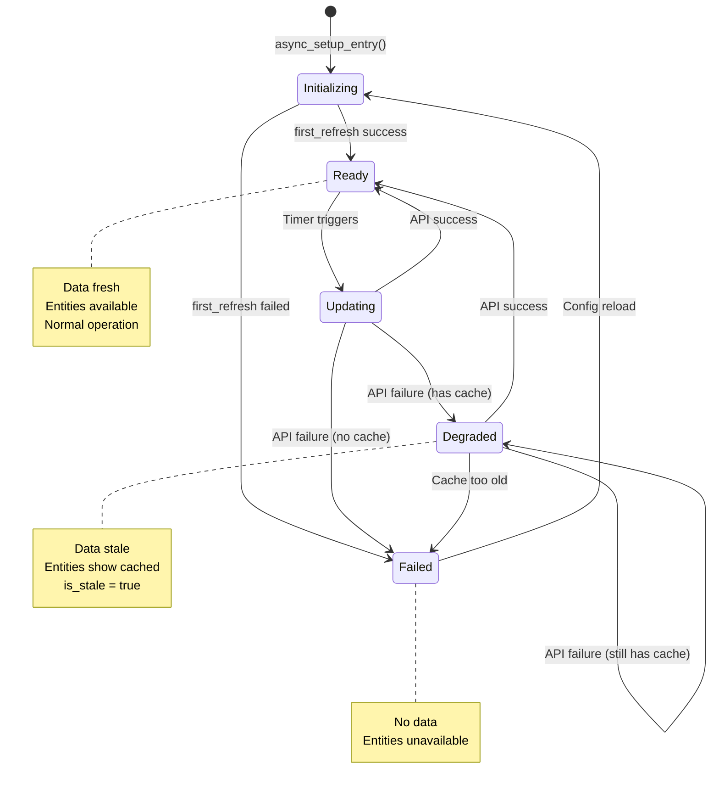
```mermaid
stateDiagram-v2
    [*] --> Initializing: async_setup_entry()
    
    Initializing --> Ready: first_refresh success
    Initializing --> Failed: first_refresh failed
    
    Ready --> Updating: Timer triggers
    Updating --> Ready: API success
    Updating --> Degraded: API failure (has cache)
    Updating --> Failed: API failure (no cache)
    
    Degraded --> Ready: API success
    Degraded --> Degraded: API failure (still has cache)
    Degraded --> Failed: Cache too old
    
    Failed --> Initializing: Config reload
    
    note right of Ready
        Data fresh
        Entities available
        Normal operation
    end note
    
    note right of Degraded
        Data stale
        Entities show cached
        is_stale = true
    end note
    
    note right of Failed
        No data
        Entities unavailable
    end note
```

### 6.2 Entity Availability Logic

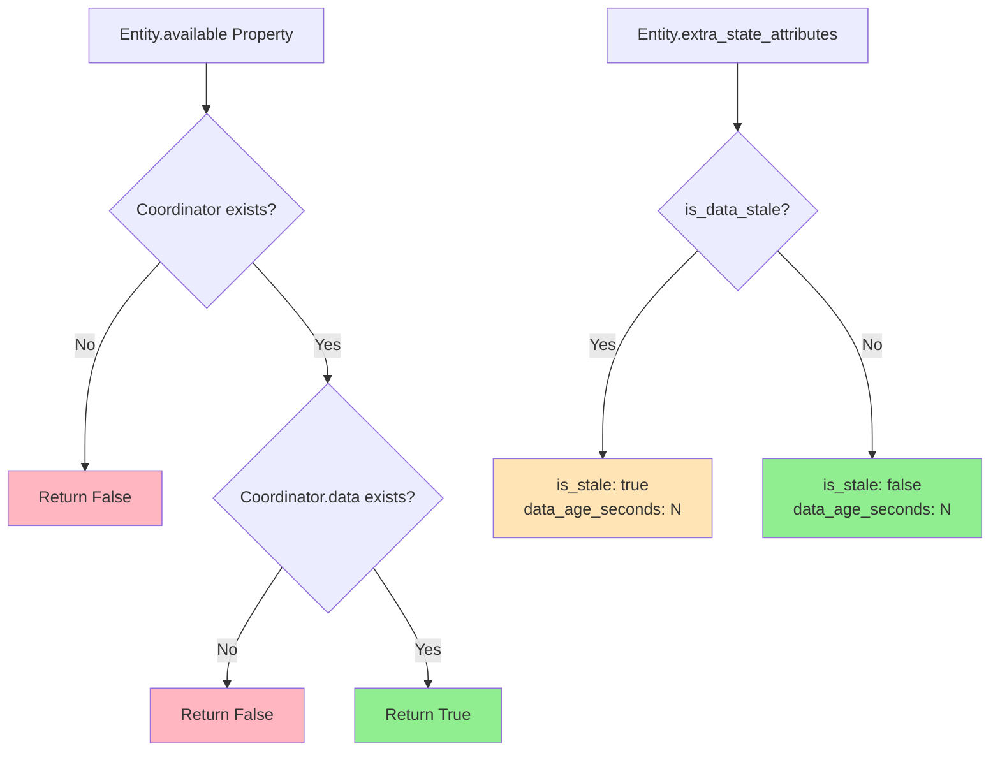
```mermaid
flowchart TD
    A[Entity.available Property] --> B{Coordinator exists?}
    B -->|No| C[Return False]
    B -->|Yes| D{Coordinator.data exists?}
    D -->|No| E[Return False]
    D -->|Yes| F[Return True]
    
    G[Entity.extra_state_attributes] --> H{is_data_stale?}
    H -->|Yes| I["is_stale: true<br>data_age_seconds: N"]
    H -->|No| J["is_stale: false<br>data_age_seconds: N"]
    
    style C fill:#FFB6C1
    style E fill:#FFB6C1
    style F fill:#90EE90
    style I fill:#FFE4B5
    style J fill:#90EE90
```

---

## 7. Error Handling

### 7.1 Exception Hierarchy

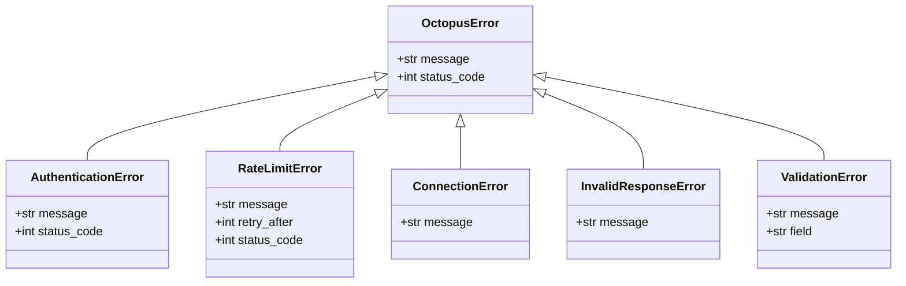
```mermaid
classDiagram
    class OctopusError {
        +str message
        +int status_code
    }
    
    class AuthenticationError {
        +str message
        +int status_code
    }
    
    class RateLimitError {
        +str message
        +int retry_after
        +int status_code
    }
    
    class ConnectionError {
        +str message
    }
    
    class InvalidResponseError {
        +str message
    }
    
    class ValidationError {
        +str message
        +str field
    }
    
    OctopusError <|-- AuthenticationError
    OctopusError <|-- RateLimitError
    OctopusError <|-- ConnectionError
    OctopusError <|-- InvalidResponseError
    OctopusError <|-- ValidationError
```

### 7.2 Error Handling Strategy

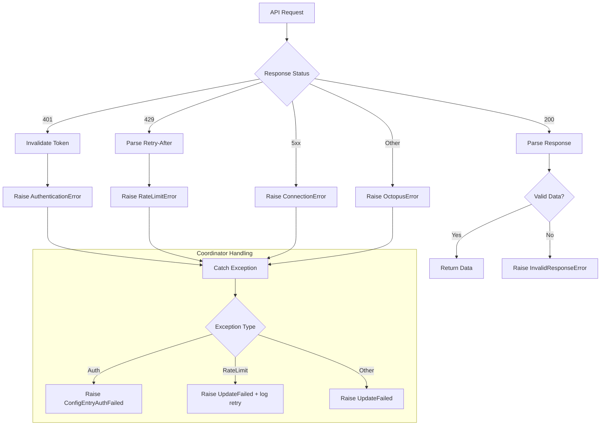
```mermaid
flowchart TD
    A[API Request] --> B{Response Status}
    
    B -->|200| C[Parse Response]
    C --> D{Valid Data?}
    D -->|Yes| E[Return Data]
    D -->|No| F[Raise InvalidResponseError]
    
    B -->|401| G[Invalidate Token]
    G --> H[Raise AuthenticationError]
    
    B -->|429| I[Parse Retry-After]
    I --> J[Raise RateLimitError]
    
    B -->|5xx| K[Raise ConnectionError]
    
    B -->|Other| L[Raise OctopusError]
    
    subgraph Coordinator Handling
        M[Catch Exception] --> N{Exception Type}
        N -->|Auth| O[Raise ConfigEntryAuthFailed]
        N -->|RateLimit| P[Raise UpdateFailed + log retry]
        N -->|Other| Q[Raise UpdateFailed]
    end
    
    H --> M
    J --> M
    K --> M
    L --> M
```

### 7.3 Retry-After Header Parsing

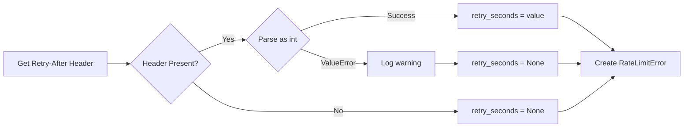
```mermaid
flowchart LR
    A[Get Retry-After Header] --> B{Header Present?}
    B -->|No| C[retry_seconds = None]
    B -->|Yes| D{Parse as int}
    D -->|Success| E[retry_seconds = value]
    D -->|ValueError| F[Log warning]
    F --> G[retry_seconds = None]
    
    E --> H[Create RateLimitError]
    G --> H
    C --> H
```

---

## 8. Configuration

### 8.1 Config Entry Structure

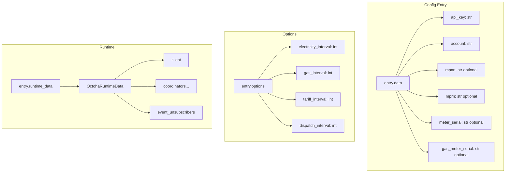
```mermaid
flowchart TD
    subgraph Config Entry
        A[entry.data] --> B[api_key: str]
        A --> C[account: str]
        A --> D[mpan: str optional]
        A --> E[mprn: str optional]
        A --> F[meter_serial: str optional]
        A --> G[gas_meter_serial: str optional]
    end
    
    subgraph Options
        H[entry.options] --> I[electricity_interval: int]
        H --> J[gas_interval: int]
        H --> K[tariff_interval: int]
        H --> L[dispatch_interval: int]
    end
    
    subgraph Runtime
        M[entry.runtime_data] --> N[OctohaRuntimeData]
        N --> O[client]
        N --> P[coordinators...]
        N --> Q[event_unsubscribers]
    end
```

### 8.2 Update Interval Configuration

| Coordinator | Config Key | Default | Range |
|-------------|------------|---------|-------|
| Electricity | `electricity_interval` | 300s (5 min) | 60-3600s |
| Gas | `gas_interval` | 300s (5 min) | 60-3600s |
| Tariff | `tariff_interval` | 1800s (30 min) | 300-7200s |
| Dispatch | `dispatch_interval` | 300s (5 min) | 60-3600s |

### 8.3 Constants Reference

```python
# API Endpoints
GRAPHQL_URL = "https://api.octopus.energy/v1/graphql/"
REST_API_URL = "https://api.octopus.energy/v1"

# Timeouts
REQUEST_TIMEOUT = 30  # seconds

# Token Management
TOKEN_EXPIRY_BUFFER = timedelta(minutes=5)
TOKEN_LIFETIME = timedelta(hours=1)

# Staleness Detection
DEFAULT_STALE_THRESHOLD = timedelta(minutes=15)
```

---

## 9. File Structure

```
src/custom_components/octoha/
├── __init__.py              # Entry point, lifecycle
├── manifest.json            # HA integration manifest
├── const.py                 # Constants and defaults
├── config_flow.py           # Setup wizard
├── coordinator.py           # Data update coordinators
├── sensor.py                # Sensor entities
├── binary_sensor.py         # Binary sensor entities
├── events.py                # Event managers
├── diagnostics.py           # Debug diagnostics
│
├── api/                     # API client layer
│   ├── __init__.py          # Package exports
│   ├── client.py            # Main facade
│   ├── auth.py              # Token management
│   ├── graphql.py           # Query definitions
│   ├── rest.py              # REST client
│   └── exceptions.py        # Error types
│
└── models/                  # Domain models
    ├── __init__.py          # Package exports
    ├── account.py           # Account, meters
    ├── consumption.py       # Usage data
    ├── tariff.py            # Rates, windows
    └── dispatch.py          # Dispatches
```

---

## 10. Integration Patterns

### 10.1 Facade Pattern (API Client)

The `OctohaApiClient` provides a unified interface to multiple backend services:

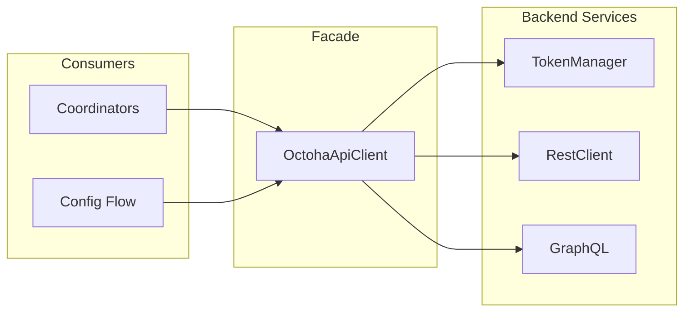
```mermaid
flowchart LR
    subgraph Consumers
        A[Coordinators]
        B[Config Flow]
    end
    
    subgraph Facade
        C[OctohaApiClient]
    end
    
    subgraph Backend Services
        D[TokenManager]
        E[RestClient]
        F[GraphQL]
    end
    
    A --> C
    B --> C
    C --> D
    C --> E
    C --> F
```

### 10.2 Observer Pattern (Coordinators)

Coordinators notify entities of data changes:

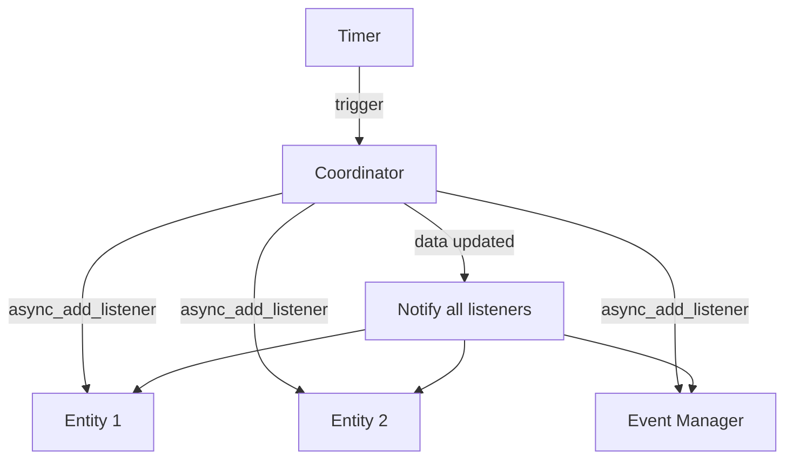
```mermaid
flowchart TD
    A[Coordinator] -->|async_add_listener| B[Entity 1]
    A -->|async_add_listener| C[Entity 2]
    A -->|async_add_listener| D[Event Manager]
    
    E[Timer] -->|trigger| A
    A -->|data updated| F[Notify all listeners]
    F --> B
    F --> C
    F --> D
```

### 10.3 Decorator Pattern (Coordinator Base)

`OctohaBaseCoordinator` adds failure tracking to HA's `DataUpdateCoordinator`:

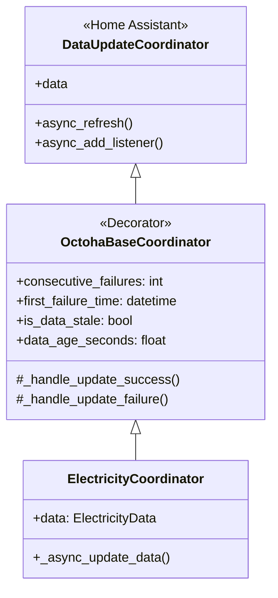
```mermaid
classDiagram
    class DataUpdateCoordinator {
        <<Home Assistant>>
        +data
        +async_refresh()
        +async_add_listener()
    }
    
    class OctohaBaseCoordinator {
        <<Decorator>>
        +consecutive_failures: int
        +first_failure_time: datetime
        +is_data_stale: bool
        +data_age_seconds: float
        #_handle_update_success()
        #_handle_update_failure()
    }
    
    class ElectricityCoordinator {
        +data: ElectricityData
        +_async_update_data()
    }
    
    DataUpdateCoordinator <|-- OctohaBaseCoordinator
    OctohaBaseCoordinator <|-- ElectricityCoordinator
```

---

## 11. Security Considerations

### 11.1 Credential Handling

- API keys stored in HA's encrypted config entry storage
- Keys never logged (sanitized in error messages)
- JWT tokens cached in memory only, not persisted

### 11.2 Data Sanitization

```python
# api/exceptions.py
def sanitize_log_message(message: str) -> str:
    """Remove sensitive data from log messages."""
    # Redacts API keys, tokens, meter IDs
```

### 11.3 Diagnostics Redaction

```python
# diagnostics.py
# API keys: sk_live_***REDACTED***
# Meter IDs: ****1234 (last 4 visible)
```

---

## 12. Future Considerations

### 12.1 Potential Enhancements

- **WebSocket Support**: Real-time live power readings
- **Multi-Account**: Support for multiple Octopus accounts
- **Export Meters**: Track solar/battery export
- **Cost Tracking**: Calculate actual energy costs

### 12.2 Scalability

The current architecture supports:
- Multiple meter points per account
- Configurable update intervals
- Graceful degradation during outages
- Independent coordinator failures

---

## Appendix A: Glossary

| Term | Definition |
|------|------------|
| **MPAN** | Meter Point Administration Number (electricity) |
| **MPRN** | Meter Point Reference Number (gas) |
| **Coordinator** | HA component for periodic data fetching |
| **Dispatch** | Intelligent Octopus charging window |
| **Agile** | Time-of-use tariff with 30-min pricing |
| **Kraken** | Octopus Energy's platform/API |

## Appendix B: API Endpoints

### GraphQL Endpoint
- URL: `https://api.octopus.energy/v1/graphql/`
- Auth: JWT token in Authorization header

### REST Endpoints
- Base: `https://api.octopus.energy/v1`
- Auth: HTTP Basic with API key as username
- Consumption: `/electricity-meter-points/{mpan}/meters/{serial}/consumption/`
- Tariffs: `/products/{code}/electricity-tariffs/{tariff}/standard-unit-rates/`

---

*Last updated: January 2026*
*Version: 0.1.0*
