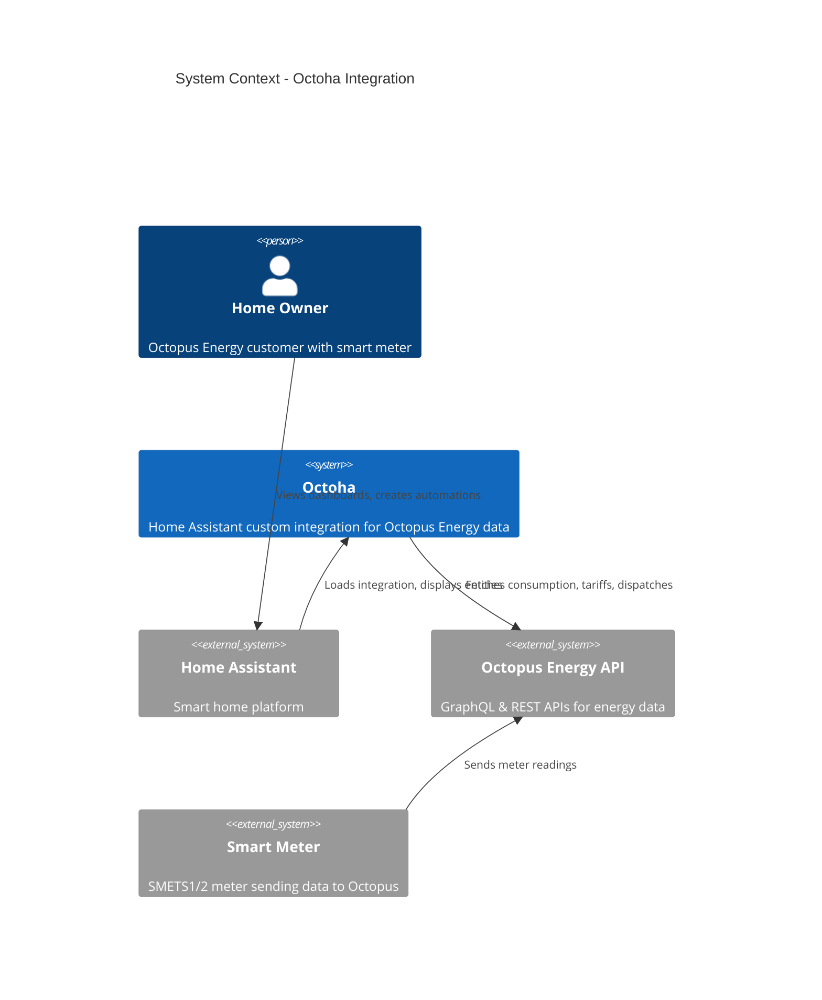
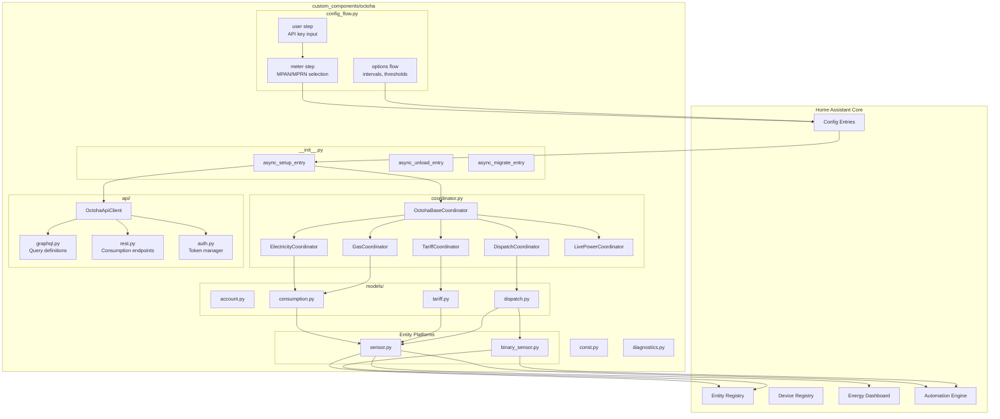
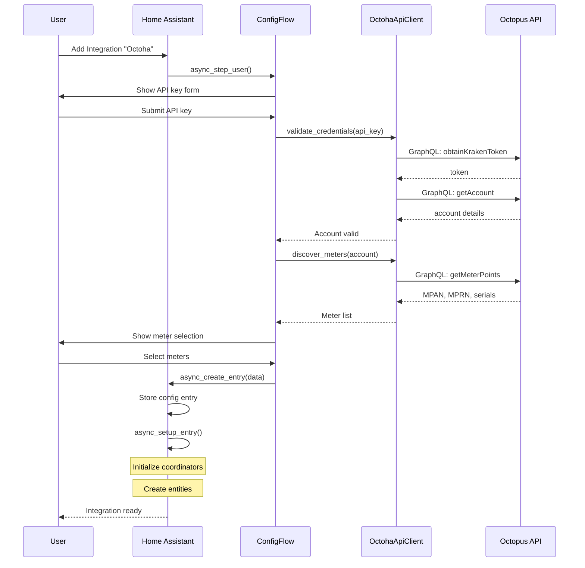
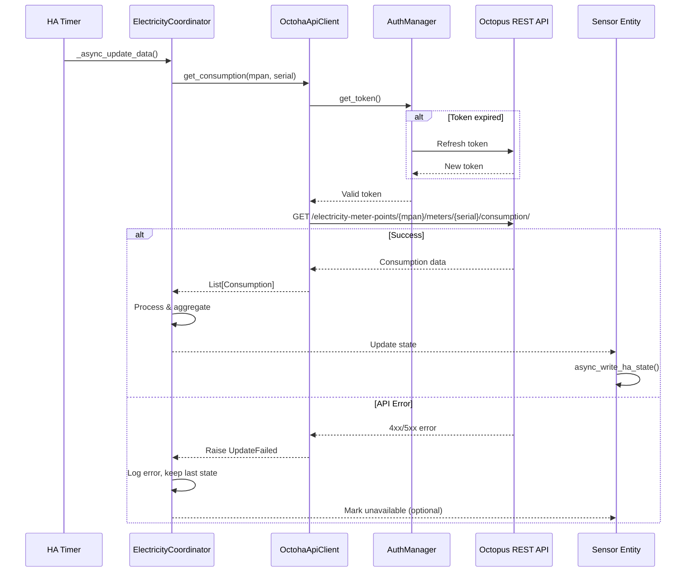
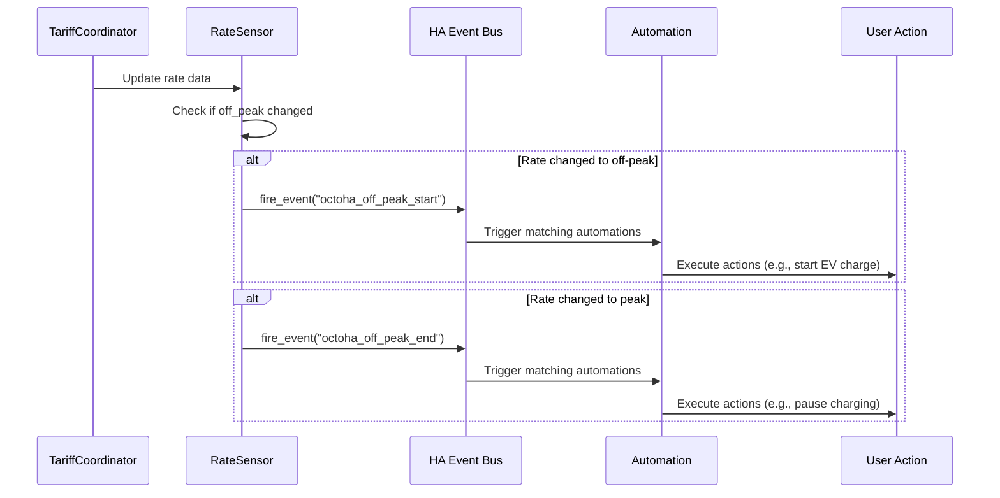

# Octoha - Component Architecture

This document details the component architecture and Home Assistant integration structure for Octoha.

## System Context Diagram



## Component Diagram



## Sequence Diagrams

### Integration Setup Flow



### Data Refresh Flow



### Automation Trigger Flow



## File Structure

```
custom_components/octoha/
├── __init__.py                 # Integration entry point
├── manifest.json               # HA manifest
├── const.py                    # Constants and defaults
├── config_flow.py              # Config + options flow
├── coordinator.py              # All coordinator classes
├── diagnostics.py              # Debug data export
├── strings.json                # UI strings (base)
│
├── api/
│   ├── __init__.py
│   ├── client.py               # Main API client facade
│   ├── auth.py                 # Token management
│   ├── graphql.py              # GraphQL queries
│   ├── rest.py                 # REST API methods
│   └── exceptions.py           # Custom exceptions
│
├── models/
│   ├── __init__.py
│   ├── account.py              # Account, MeterPoint
│   ├── consumption.py          # Consumption, GasConsumption
│   ├── tariff.py               # Tariff, Rate, CurrentRate
│   └── dispatch.py             # Dispatch, SavingSession
│
├── sensor.py                   # Sensor entity definitions
├── binary_sensor.py            # Binary sensor definitions
│
└── translations/
    └── en.json                 # English translations
```

## Component Specifications

### __init__.py

Entry point for the integration.

```python
PLATFORMS = [Platform.SENSOR, Platform.BINARY_SENSOR]

async def async_setup_entry(hass: HomeAssistant, entry: ConfigEntry) -> bool:
    """Set up Octoha from a config entry."""
    # 1. Create API client
    client = OctohaApiClient(
        api_key=entry.data[CONF_API_KEY],
        account=entry.data[CONF_ACCOUNT],
        mpan=entry.data.get(CONF_MPAN),
        mprn=entry.data.get(CONF_MPRN),
        # ... other config
    )
    
    # 2. Validate connection
    try:
        await client.async_validate()
    except AuthenticationError as err:
        raise ConfigEntryAuthFailed from err
    
    # 3. Create coordinators
    coordinators = {
        "electricity": ElectricityCoordinator(hass, client, entry),
        "gas": GasCoordinator(hass, client, entry),
        "tariff": TariffCoordinator(hass, client, entry),
        "dispatch": DispatchCoordinator(hass, client, entry),
    }
    
    # 4. Initial data fetch
    for coord in coordinators.values():
        await coord.async_config_entry_first_refresh()
    
    # 5. Store runtime data
    hass.data.setdefault(DOMAIN, {})[entry.entry_id] = {
        "client": client,
        "coordinators": coordinators,
    }
    
    # 6. Set up platforms
    await hass.config_entries.async_forward_entry_setups(entry, PLATFORMS)
    
    return True
```

### manifest.json

```json
{
  "domain": "octoha",
  "name": "Octoha - Octopus Energy",
  "codeowners": ["@yourusername"],
  "config_flow": true,
  "dependencies": [],
  "documentation": "https://github.com/yourusername/octoha",
  "iot_class": "cloud_polling",
  "issue_tracker": "https://github.com/yourusername/octoha/issues",
  "requirements": [],
  "version": "0.1.0"
}
```

### const.py

```python
"""Constants for Octoha integration."""
from datetime import timedelta

DOMAIN = "octoha"

# Config keys
CONF_API_KEY = "api_key"
CONF_ACCOUNT = "account"
CONF_MPAN = "mpan"
CONF_MPRN = "mprn"
CONF_METER_SERIAL = "meter_serial"
CONF_GAS_METER_SERIAL = "gas_meter_serial"
CONF_REGION = "region"

# Update intervals
UPDATE_INTERVAL_ELECTRICITY = timedelta(minutes=5)
UPDATE_INTERVAL_GAS = timedelta(minutes=5)
UPDATE_INTERVAL_TARIFF = timedelta(hours=1)
UPDATE_INTERVAL_DISPATCH = timedelta(minutes=5)
UPDATE_INTERVAL_LIVE = timedelta(seconds=30)

# API endpoints
GRAPHQL_URL = "https://api.octopus.energy/v1/graphql/"
REST_API_URL = "https://api.octopus.energy/v1"

# Token refresh
TOKEN_EXPIRY_BUFFER = timedelta(minutes=5)
TOKEN_LIFETIME = timedelta(hours=1)

# Defaults
DEFAULT_REGION = "J"  # Scotland
```

### coordinator.py

```python
"""Data coordinators for Octoha."""
from homeassistant.helpers.update_coordinator import (
    DataUpdateCoordinator,
    UpdateFailed,
)

class OctohaBaseCoordinator(DataUpdateCoordinator):
    """Base coordinator with common functionality."""
    
    def __init__(
        self,
        hass: HomeAssistant,
        client: OctohaApiClient,
        entry: ConfigEntry,
        update_interval: timedelta,
        name: str,
    ) -> None:
        super().__init__(
            hass,
            _LOGGER,
            name=f"Octoha {name}",
            update_interval=update_interval,
        )
        self.client = client
        self.entry = entry


class ElectricityCoordinator(OctohaBaseCoordinator):
    """Coordinator for electricity consumption data."""
    
    def __init__(self, hass, client, entry):
        super().__init__(
            hass, client, entry,
            UPDATE_INTERVAL_ELECTRICITY,
            "Electricity"
        )
    
    async def _async_update_data(self) -> dict:
        """Fetch electricity consumption data."""
        try:
            consumption = await self.client.get_consumption(periods=48)
            daily = await self.client.get_daily_usage(days=7)
            
            return {
                "current": consumption[0] if consumption else None,
                "today_kwh": self._calculate_today_total(consumption),
                "daily": daily,
                "last_updated": datetime.now(),
            }
        except AuthenticationError as err:
            raise ConfigEntryAuthFailed from err
        except OctopusError as err:
            raise UpdateFailed(f"Error fetching electricity data: {err}")
```

### sensor.py

```python
"""Sensor entities for Octoha."""
from homeassistant.components.sensor import (
    SensorDeviceClass,
    SensorEntity,
    SensorStateClass,
)

class OctohaElectricityDailySensor(CoordinatorEntity, SensorEntity):
    """Sensor for daily electricity consumption."""
    
    _attr_device_class = SensorDeviceClass.ENERGY
    _attr_state_class = SensorStateClass.TOTAL_INCREASING
    _attr_native_unit_of_measurement = UnitOfEnergy.KILO_WATT_HOUR
    _attr_icon = "mdi:flash"
    
    def __init__(self, coordinator: ElectricityCoordinator, entry: ConfigEntry):
        super().__init__(coordinator)
        self._attr_unique_id = f"{entry.entry_id}_electricity_daily"
        self._attr_name = "Electricity Daily"
        self.entity_id = "sensor.octoha_electricity_daily"
    
    @property
    def native_value(self) -> float | None:
        """Return today's electricity usage."""
        if self.coordinator.data:
            return self.coordinator.data.get("today_kwh")
        return None
    
    @property
    def extra_state_attributes(self) -> dict:
        """Return additional attributes."""
        return {
            "last_updated": self.coordinator.data.get("last_updated"),
            "mpan": self.coordinator.entry.data.get(CONF_MPAN),
            "attribution": "Data from Octopus Energy",
        }
```

## Configuration Options

### Config Flow Data

Stored in `entry.data` (requires re-auth to change):

| Key | Type | Description |
|-----|------|-------------|
| `api_key` | str | Octopus API key (sk_live_xxx) |
| `account` | str | Account number (A-XXXXXXXX) |
| `mpan` | str | Electricity MPAN (13 digits) |
| `meter_serial` | str | Electricity meter serial |
| `mprn` | str | Gas MPRN |
| `gas_meter_serial` | str | Gas meter serial |
| `region` | str | DNO region code (A-P) |

### Options Flow Data

Stored in `entry.options` (changeable without re-auth):

| Key | Type | Default | Description |
|-----|------|---------|-------------|
| `electricity_interval` | int | 300 | Electricity update interval (seconds) |
| `gas_interval` | int | 300 | Gas update interval (seconds) |
| `tariff_interval` | int | 3600 | Tariff update interval (seconds) |
| `enable_live_power` | bool | True | Enable Home Mini live power |
| `cost_threshold_alert` | float | None | Daily cost alert threshold (£) |

## Device Registry

Octoha creates a device for the integration:

```python
device_info = DeviceInfo(
    identifiers={(DOMAIN, entry.entry_id)},
    name="Octoha Energy Monitor",
    manufacturer="Octopus Energy",
    model="Smart Meter Integration",
    sw_version=VERSION,
    configuration_url="https://octopus.energy/dashboard",
)
```

## Events

Octoha fires these events for automation triggers:

| Event | Data | Description |
|-------|------|-------------|
| `octoha_off_peak_start` | `{"rate": 7.5, "ends_at": "..."}` | Off-peak period started |
| `octoha_off_peak_end` | `{"rate": 30.0}` | Off-peak period ended |
| `octoha_dispatch_start` | `{"source": "smart-charge", "ends_at": "..."}` | Intelligent dispatch started |
| `octoha_dispatch_end` | `{"source": "smart-charge", "kwh": 15.2}` | Intelligent dispatch ended |
| `octoha_saving_session_start` | `{"code": "...", "ends_at": "..."}` | Saving session started |
| `octoha_threshold_exceeded` | `{"type": "cost", "value": 5.50}` | Configurable threshold exceeded |

## Testing Strategy

### Unit Tests

```
tests/
├── conftest.py                 # Fixtures (mock client, coordinators)
├── test_api_client.py          # API client unit tests
├── test_coordinators.py        # Coordinator update logic
├── test_sensors.py             # Entity state calculations
├── test_config_flow.py         # Config flow validation
└── fixtures/
    ├── consumption.json        # Sample API responses
    ├── tariff.json
    └── dispatch.json
```

### Integration Tests

- Full config flow with mocked API
- Coordinator refresh cycles
- Entity state updates
- Options flow changes

## References

- [ADR-001: Octoha Architecture](../ADRs/adr-001-octoha-architecture.md)
- [ERD & Data Models](./octoha-erd-data-models.md)
- [PRD: Octoha](../PRDs/prd-octoha.md)
- [HA Developer Docs](https://developers.home-assistant.io/)
