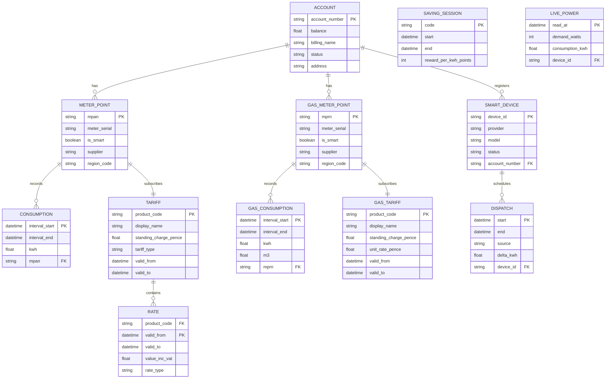
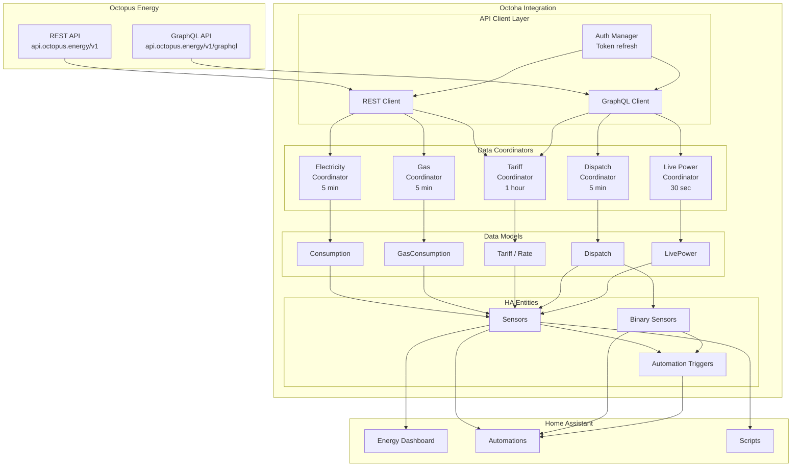

# Octoha - Entity Relationship Diagram & Data Models

This document defines the data models and entity relationships for the Octoha Home Assistant integration.

## Entity Relationship Diagram



## Data Model Definitions

### Core Models

#### Account

Represents the Octopus Energy customer account.

```python
@dataclass
class Account:
    """Octopus Energy account information."""
    account_number: str          # e.g., "A-FB05ED6C"
    balance: float               # GBP (negative = credit)
    billing_name: str
    status: str                  # ACTIVE, CLOSED, etc.
    address: str
    properties: list[Property]   # Associated properties
```

#### MeterPoint (Electricity)

```python
@dataclass
class MeterPoint:
    """Electricity meter point."""
    mpan: str                    # 13-digit Meter Point Admin Number
    meter_serial: str            # Physical meter serial
    is_smart: bool               # SMETS1/SMETS2 meter
    supplier: str                # Current supplier code
    region_code: str             # DNO region (A-P)
```

#### GasMeterPoint

```python
@dataclass
class GasMeterPoint:
    """Gas meter point."""
    mprn: str                    # Meter Point Reference Number
    meter_serial: str            # Physical meter serial
    is_smart: bool
    supplier: str
    region_code: str
```

### Consumption Models

#### Consumption (Electricity)

Half-hourly electricity consumption reading.

```python
@dataclass
class Consumption:
    """Half-hourly electricity consumption."""
    interval_start: datetime     # Start of 30-min period (UTC)
    interval_end: datetime       # End of 30-min period (UTC)
    kwh: float                   # Energy consumed in period
```

#### GasConsumption

Half-hourly gas consumption reading with unit conversion.

```python
@dataclass
class GasConsumption:
    """Half-hourly gas consumption."""
    interval_start: datetime
    interval_end: datetime
    kwh: float                   # Energy in kWh
    m3: Optional[float]          # Volume in m³ (SMETS2 raw value)

    # Conversion: 1 m³ ≈ 11.1868 kWh
    # (volume correction × calorific value × kWh conversion)
```

#### DailyUsage

Aggregated daily consumption for dashboard display.

```python
@dataclass
class DailyUsage:
    """Aggregated daily usage."""
    date: date
    electricity_kwh: float
    gas_kwh: float
    electricity_cost_gbp: float
    gas_cost_gbp: float
```

### Tariff Models

#### Tariff (Electricity)

```python
@dataclass
class Tariff:
    """Electricity tariff details."""
    product_code: str            # e.g., "INTELLI-VAR-22-10-14"
    display_name: str            # e.g., "Intelligent Octopus Go"
    standing_charge: float       # pence/day inc VAT
    tariff_type: TariffType      # STANDARD, TIME_OF_USE, AGILE

    # Time-of-use specific (Intelligent Go, Octopus Go)
    off_peak_rate: Optional[float]   # pence/kWh
    peak_rate: Optional[float]       # pence/kWh
    off_peak_windows: list[TimeWindow]
```

#### TariffType

```python
class TariffType(Enum):
    STANDARD = "standard"        # Fixed rate
    TIME_OF_USE = "time_of_use"  # Go, Intelligent Go
    AGILE = "agile"              # Half-hourly variable
    TRACKER = "tracker"          # Daily variable
```

#### TimeWindow

```python
@dataclass
class TimeWindow:
    """Off-peak time window definition."""
    start_time: time             # e.g., 23:30
    end_time: time               # e.g., 05:30
    rate: float                  # pence/kWh during window
```

#### Rate

```python
@dataclass
class Rate:
    """Point-in-time rate information."""
    valid_from: datetime
    valid_to: Optional[datetime]
    value_inc_vat: float         # pence/kWh
    is_off_peak: bool
```

#### CurrentRate

Runtime rate calculation with countdown.

```python
@dataclass
class CurrentRate:
    """Current rate with time-of-use context."""
    rate: float                  # Current pence/kWh
    is_off_peak: bool
    period_end: datetime         # When current rate ends
    next_rate: float             # Rate after period_end

    @property
    def time_remaining(self) -> timedelta:
        return self.period_end - datetime.now()
```

### Dispatch Models (Intelligent Go)

#### Dispatch

Smart charging window scheduled by Octopus.

```python
@dataclass
class Dispatch:
    """Intelligent Octopus dispatch slot."""
    start: datetime
    end: datetime
    source: DispatchSource       # SMART_CHARGE, BUMP_CHARGE
    delta_kwh: Optional[float]   # Energy transferred (completed only)

    @property
    def duration_minutes(self) -> int:
        return int((self.end - self.start).total_seconds() / 60)

    @property
    def is_active(self) -> bool:
        now = datetime.now(self.start.tzinfo)
        return self.start <= now <= self.end
```

#### DispatchSource

```python
class DispatchSource(Enum):
    SMART_CHARGE = "smart-charge"    # Scheduled by Octopus
    BUMP_CHARGE = "bump-charge"      # User-requested boost
```

#### DispatchStatus

Aggregated dispatch state for binary sensor.

```python
@dataclass
class DispatchStatus:
    """Current dispatch state."""
    is_dispatching: bool
    current_dispatch: Optional[Dispatch]
    next_dispatch: Optional[Dispatch]
    planned_dispatches: list[Dispatch]
```

### Saving Sessions

```python
@dataclass
class SavingSession:
    """Saving Session / Free Electricity event."""
    code: str                    # Unique event code
    start: datetime
    end: datetime
    reward_per_kwh: int          # Octopoints per kWh saved
    joined: bool                 # User opted in

    @property
    def is_active(self) -> bool:
        now = datetime.now(self.start.tzinfo)
        return self.start <= now <= self.end
```

### Live Power (Home Mini)

```python
@dataclass
class LivePower:
    """Real-time power from Home Mini CAD."""
    demand_watts: int            # Current power draw
    read_at: datetime            # Timestamp of reading
    consumption_kwh: Optional[float]  # Cumulative since midnight

    @property
    def demand_kw(self) -> float:
        return self.demand_watts / 1000
```

### Smart Devices

```python
@dataclass
class SmartDevice:
    """Registered Krakenflexdevice (EV, charger, battery)."""
    device_id: str               # Octopus device ID
    provider: str                # OHME, TESLA, WALLBOX, etc.
    model: Optional[str]
    status: DeviceStatus
```

## Home Assistant Entity Mapping

### Sensors

| Entity ID                              | Model Source                      | Unit     | Device Class |
| -------------------------------------- | --------------------------------- | -------- | ------------ |
| `sensor.octoha_electricity_current`    | `Consumption` (latest)            | kWh      | energy       |
| `sensor.octoha_electricity_daily`      | `DailyUsage.electricity_kwh`      | kWh      | energy       |
| `sensor.octoha_electricity_rate`       | `CurrentRate.rate`                | GBP/kWh  | monetary     |
| `sensor.octoha_gas_current`            | `GasConsumption` (latest)         | kWh      | energy       |
| `sensor.octoha_gas_daily`              | `DailyUsage.gas_kwh`              | kWh      | energy       |
| `sensor.octoha_gas_rate`               | `GasTariff.unit_rate`             | GBP/kWh  | monetary     |
| `sensor.octoha_electricity_cost_today` | `DailyUsage.electricity_cost_gbp` | GBP      | monetary     |
| `sensor.octoha_gas_cost_today`         | `DailyUsage.gas_cost_gbp`         | GBP      | monetary     |
| `sensor.octoha_account_balance`        | `Account.balance`                 | GBP      | monetary     |
| `sensor.octoha_live_power`             | `LivePower.demand_watts`          | W        | power        |
| `sensor.octoha_next_dispatch`          | `DispatchStatus.next_dispatch`    | datetime | timestamp    |

### Binary Sensors

| Entity ID                                    | Model Source                    | Device Class |
| -------------------------------------------- | ------------------------------- | ------------ |
| `binary_sensor.octoha_off_peak`              | `CurrentRate.is_off_peak`       | None         |
| `binary_sensor.octoha_dispatch_active`       | `DispatchStatus.is_dispatching` | running      |
| `binary_sensor.octoha_saving_session_active` | `SavingSession.is_active`       | None         |

### Entity Attributes

All sensors include metadata attributes:

```python
{
    "last_updated": "2026-01-18T10:30:00Z",
    "data_source": "rest_api",           # or "graphql_api"
    "meter_serial": "12A3456789",
    "mpan": "1234567890123",
    "tariff_name": "Intelligent Octopus Go",
    "region": "J",
    "attribution": "Data from Octopus Energy"
}
```

## Data Flow Diagram



## Coordinator Update Intervals

| Coordinator | Interval | Rationale                                                            |
| ----------- | -------- | -------------------------------------------------------------------- |
| Electricity | 5 min    | Balance freshness vs API limits; data typically 30min delayed anyway |
| Gas         | 5 min    | Same as electricity                                                  |
| Tariff      | 30 min   | Tariff rates change infrequently (except Agile)                      |
| Dispatch    | 5 min    | Dispatches can be scheduled/changed; need timely updates             |
| Live Power  | 30 sec   | Near real-time display; Home Mini updates every 10-30s               |

## Error Handling States

Entities should handle these states gracefully:

| State         | Entity Display                        | Attributes                                         |
| ------------- | ------------------------------------- | -------------------------------------------------- |
| `unknown`     | Initial state before first data fetch | `{"error": null}`                                  |
| `unavailable` | API unreachable or auth failed        | `{"error": "API connection failed"}`               |
| Stale data    | Last known value                      | `{"stale": true, "last_successful_update": "..."}` |

## References

- [ADR-001: Octoha Architecture](../ADRs/adr-001-octoha-architecture.md)
- [PRD: Octoha](../PRDs/prd-octoha.md)
- [open-octopus models.py](https://github.com/abracadabra50/open-octopus/blob/main/src/open_octopus/models.py)
