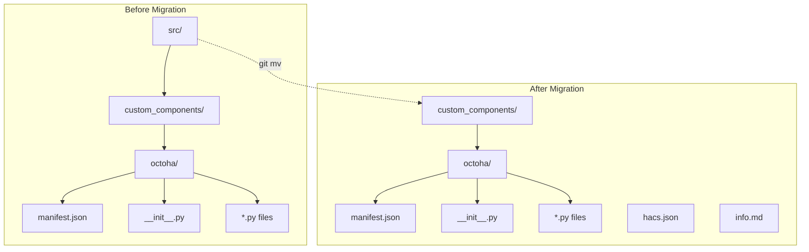

# HACS Repository Structure Migration Plan

## 1. Title

Migrate Octoha Integration to HACS-Compliant Repository Structure

## 2. Short description

Restructure the Octoha Home Assistant integration repository from the current `src/custom_components/` layout to the HACS-required `custom_components/` root structure, adding required HACS metadata files and updating all build configuration paths to enable publication in the Home Assistant Community Store.

## 3. Current status

```yaml
owner: Sam Carrington <octopus@gwawr.co.uk>
state: proposed
last_updated: 2026-01-23
blockers: []
```

## 4. Objectives

1. Move integration files from `src/custom_components/octoha/` to `custom_components/octoha/` to meet HACS discovery requirements.
2. Create all required HACS metadata files (`hacs.json`, `info.md`) with valid configuration.
3. Update all build tooling paths in `pyproject.toml` to reflect the new structure.
4. Update CI/CD workflows to reference correct paths after migration.
5. Validate that all existing tests (360+) continue to pass after restructuring.
6. Enable the repository to pass HACS validation and be installable via HACS.

## 5. Success criteria

| Name | Metric | Target | Verification |
|------|--------|--------|--------------|
| Test Suite Passes | pytest exit code | 0 (all 360+ tests pass) | Run `pytest` after migration and confirm 100% pass rate |
| HACS Structure Valid | Directory structure | `custom_components/octoha/` exists at root | Check file exists at `./custom_components/octoha/manifest.json` |
| HACS Metadata Valid | hacs.json format | Valid JSON with required fields | Run HACS Action validation or manual JSON schema check |
| CI/CD Passes | GitHub Actions | All workflow jobs succeed | Push to branch and verify all checks pass |
| Integration Loads | HA import test | No import errors | Run `python -c "from custom_components.octoha import *"` |
| Local HACS Install | HACS installation | Integration discoverable and installable | Add repo as custom repository in HACS and install |

## 6. Scope

```yaml
in:
  - Move all integration files from src/custom_components/octoha/ to custom_components/octoha/
  - Create hacs.json metadata file at repository root
  - Create info.md description file at repository root
  - Update pyproject.toml paths (setuptools.packages.find, pytest.pythonpath, ruff.src, coverage.run.source)
  - Update .github/workflows/test.yml paths
  - Update .github/workflows/lint.yml paths
  - Remove empty src/custom_components/ directory after migration
  - Validate all tests pass with new structure
  - Validate HACS compliance

out:
  - Publishing to HACS default repository (separate task after migration)
  - Adding new integration features or functionality
  - Changing integration domain name or branding
  - Adding new translations beyond English
  - Modifying integration code logic
  - Version bumping (keep at 0.1.0)
```

## 7. Stakeholders & Roles

| Name | Role | Responsibility | Contact |
|------|------|----------------|---------|
| Sam Carrington | Owner/Developer | Responsible for delivery and review | octopus@gwawr.co.uk |

## 8. High-level timeline & milestones

1. `M1` — Plan approved and ready for implementation — 2026-01-24 — Sam Carrington
2. `M2` — Directory structure migrated — 2026-01-24 — Sam Carrington
3. `M3` — HACS metadata files created — 2026-01-24 — Sam Carrington
4. `M4` — Build configuration updated — 2026-01-24 — Sam Carrington
5. `M5` — All tests passing — 2026-01-24 — Sam Carrington
6. `M6` — HACS validation complete — 2026-01-25 — Sam Carrington

## 9. Task list

### Phase 1: Preparation

- T-001 | Verify all tests pass before migration begins | Sam Carrington | complexity: XS | deps: [] | done: false
- T-002 | Create backup branch of current state | Sam Carrington | complexity: XS | deps: [T-001] | done: false

### Phase 2: Directory Structure Migration

- T-003 | Create custom_components/ directory at repository root | Sam Carrington | complexity: XS | deps: [T-002] | done: false
- T-004 | Move src/custom_components/octoha/ to custom_components/octoha/ | Sam Carrington | complexity: S | deps: [T-003] | done: false
- T-005 | Remove empty src/custom_components/ directory | Sam Carrington | complexity: XS | deps: [T-004] | done: false
- T-006 | Remove empty src/ directory (if applicable) | Sam Carrington | complexity: XS | deps: [T-005] | done: false

### Phase 3: Create HACS Metadata Files

- T-007 | Create hacs.json with integration metadata | Sam Carrington | complexity: S | deps: [T-004] | done: false
- T-008 | Create info.md with integration description | Sam Carrington | complexity: S | deps: [T-004] | done: false

### Phase 4: Update Build Configuration

- T-009 | Update pyproject.toml setuptools.packages.find.where from ["src"] to ["."] | Sam Carrington | complexity: S | deps: [T-004] | done: false
- T-010 | Update pyproject.toml pytest.pythonpath from ["src"] to ["."] | Sam Carrington | complexity: XS | deps: [T-009] | done: false
- T-011 | Update pyproject.toml ruff.src from ["src", "tests"] to ["custom_components", "tests"] | Sam Carrington | complexity: XS | deps: [T-009] | done: false
- T-012 | Update pyproject.toml coverage.run.source from ["src/custom_components/octoha"] to ["custom_components/octoha"] | Sam Carrington | complexity: XS | deps: [T-009] | done: false

### Phase 5: Update CI/CD Workflows

- T-013 | Update .github/workflows/test.yml pytest coverage path | Sam Carrington | complexity: S | deps: [T-004] | done: false
- T-014 | Update .github/workflows/test.yml validation paths for manifest.json, strings.json, translations | Sam Carrington | complexity: S | deps: [T-013] | done: false
- T-015 | Update .github/workflows/lint.yml ruff check paths | Sam Carrington | complexity: S | deps: [T-004] | done: false
- T-016 | Update .github/workflows/lint.yml mypy path | Sam Carrington | complexity: XS | deps: [T-015] | done: false

### Phase 6: Validation

- T-017 | Run full test suite and verify all 255+ tests pass | Sam Carrington | complexity: S | deps: [T-012, T-016] | done: false
- T-018 | Run ruff linter and verify no errors | Sam Carrington | complexity: XS | deps: [T-017] | done: false
- T-019 | Run mypy type checker and verify no errors | Sam Carrington | complexity: XS | deps: [T-018] | done: false
- T-020 | Validate hacs.json format is correct | Sam Carrington | complexity: XS | deps: [T-007] | done: false
- T-021 | Test integration import works with new paths | Sam Carrington | complexity: XS | deps: [T-017] | done: false

### Phase 7: HACS Compliance Testing

- T-022 | Add repository as custom HACS repository locally | Sam Carrington | complexity: S | deps: [T-021] | done: false
- T-023 | Verify integration is discoverable in HACS | Sam Carrington | complexity: XS | deps: [T-022] | done: false
- T-024 | Install integration via HACS and verify it loads | Sam Carrington | complexity: S | deps: [T-023] | done: false

### Phase 8: Cleanup and Documentation

- T-025 | Update any documentation referencing src/ paths | Sam Carrington | complexity: S | deps: [T-024] | done: false
- T-026 | Commit all changes and push for review | Sam Carrington | complexity: XS | deps: [T-025] | done: false

## 10. Risks and mitigations

| ID | Description | Probability | Impact | Mitigation | Owner |
|----|-------------|-------------|--------|------------|-------|
| R-001 | Test suite fails after path changes due to import errors | Low | High | Create backup branch before migration; carefully update all PYTHONPATH references; test incrementally | Sam Carrington |
| R-002 | CI/CD workflows fail due to missed path references | Medium | Medium | Review all workflow files systematically; run CI immediately after changes to catch issues early | Sam Carrington |
| R-003 | HACS validation fails due to incorrect metadata format | Low | Medium | Reference official HACS documentation for hacs.json schema; use examples from popular integrations | Sam Carrington |
| R-004 | Local development breaks due to changed import paths | Low | Low | Update pytest pythonpath; document new development setup in README if needed | Sam Carrington |
| R-005 | Breaking change causes loss of work | Low | High | Create backup branch before starting; use git to track all changes; commit frequently | Sam Carrington |

## 11. Assumptions

- The current test suite (255+ tests) provides comprehensive coverage to detect any regressions from path changes.
- HACS requires `custom_components/` directory at repository root (not nested under `src/`).
- No changes to integration code logic are required for HACS compliance.
- The repository will be added as a custom HACS repository initially before potential submission to the default HACS repository.
- Python path resolution will work correctly after updating `pyproject.toml` configuration.
- GitHub Actions runners will correctly use updated workflow paths.

## 12. Implementation approach / Technical narrative

**TL;DR**: This migration involves moving the integration directory from `src/custom_components/octoha/` to `custom_components/octoha/`, creating two HACS metadata files, and updating approximately 10 path references across build and CI configuration files.

### Current State

The Octoha integration currently follows a Python package structure with source code under `src/`:

```
octopus-ha/
├── src/
│   └── custom_components/
│       └── octoha/           # Integration files
├── tests/
├── pyproject.toml
└── .github/workflows/
```

This structure is common for Python packages but does not meet HACS requirements for Home Assistant custom integrations.

### Target State

HACS requires custom integrations to have the `custom_components/` directory at the repository root:

```
octopus-ha/
├── custom_components/
│   └── octoha/               # Integration files (moved)
├── hacs.json                 # NEW: HACS metadata
├── info.md                   # NEW: Short description
├── tests/
├── pyproject.toml            # UPDATED: paths
└── .github/workflows/        # UPDATED: paths
```

### Migration Strategy

1. **Directory Movement**: Use `git mv` to preserve history:
   ```bash
   mkdir -p custom_components
   git mv src/custom_components/octoha custom_components/octoha
   rm -rf src/custom_components
   rmdir src  # Only if empty
   ```

2. **HACS Metadata Creation**:
   
   **hacs.json** (required):
   ```json
   {
     "name": "Octoha - Octopus Energy",
     "render_readme": true,
     "homeassistant": "2024.1.0"
   }
   ```
   
   **info.md** (optional but recommended):
   A brief markdown description shown in the HACS UI.

3. **Configuration Updates**:

   **pyproject.toml changes**:
   - `[tool.setuptools.packages.find] where = ["."]` (was `["src"]`)
   - `[tool.pytest.ini_options] pythonpath = ["."]` (was `["src"]`)
   - `[tool.ruff] src = ["custom_components", "tests"]` (was `["src", "tests"]`)
   - `[tool.coverage.run] source = ["custom_components/octoha"]` (was `["src/custom_components/octoha"]`)

   **GitHub Workflows changes**:
   - test.yml: Update coverage path and validation file paths
   - lint.yml: Update ruff and mypy source paths

### Rollback Strategy

If issues are discovered after migration:
1. Revert to the backup branch created in T-002
2. All changes are tracked in git, enabling easy revert with `git revert` or `git reset`
3. No data migration or external dependencies make rollback straightforward

### Architecture Diagram



## 13. Testing & validation plan

### Unit Tests
- **Scope**: All existing 255+ tests in `tests/` directory
- **Expected Coverage**: Maintain current coverage levels (>80%)
- **Validation**: Run `pytest --cov=custom_components/octoha` and verify all tests pass

### Integration Tests
- **Import Validation**: Verify integration can be imported with new paths
  ```python
  python -c "from custom_components.octoha import async_setup_entry"
  ```
- **Manifest Validation**: Verify JSON files are valid
  ```python
  python -c "import json; json.load(open('custom_components/octoha/manifest.json'))"
  ```

### End-to-End Tests
- **HACS Installation Test**:
  1. Add repository as custom HACS repository
  2. Search for "Octoha" in HACS
  3. Install integration via HACS
  4. Verify integration appears in Home Assistant integrations
  5. Verify config flow initiates correctly

### CI/CD Validation
- **GitHub Actions**: Push changes to branch and verify all workflow jobs pass
- **Coverage**: Verify coverage report generates correctly with new paths

## 14. Deployment plan & roll-back strategy

### Environments
1. **Local Development**: First validation environment
2. **GitHub Actions CI**: Automated testing environment
3. **Local Home Assistant**: HACS installation testing
4. **Production**: User installations via HACS (after publication)

### Deployment Steps
1. Create feature branch for migration
2. Execute all migration tasks (T-003 through T-025)
3. Run local tests to validate
4. Push to GitHub and verify CI passes
5. Create pull request for review
6. Merge to main after approval
7. Tag release if preparing for HACS submission

### Roll-back Criteria
- Any test failures that cannot be resolved within 2 hours
- CI/CD failures related to path resolution
- HACS validation failures that indicate structural issues

### Roll-back Steps
1. `git checkout main`
2. `git branch -D <migration-branch>` (if not merged)
3. If merged: `git revert <merge-commit>`
4. Document issues encountered for future retry

## 15. Monitoring & observability

N/A - This is a repository structure migration with no runtime components to monitor. Validation is performed through tests and HACS installation verification.

## 16. Compliance, security & privacy considerations

### Data Classification
- No user data is affected by this migration
- All changes are to repository structure and configuration only

### Security Review
- [ ] No new dependencies added
- [ ] No changes to authentication or authorization logic
- [ ] No changes to data handling code
- [ ] License file (MIT) preserved

### Privacy Considerations
- N/A - No changes to data collection or processing

## 17. Communication plan

### Notifications
| Event | Channel | Audience | Message |
|-------|---------|----------|---------|
| Migration Complete | GitHub Release Notes | Users | "Repository restructured for HACS compatibility" |
| HACS Available | README.md update | Users | "Now installable via HACS" |

### Templates
- **Release Note**: "Repository restructured to support HACS installation. No functional changes."

## 18. Related documents & links

- [Existing HACS Migration Research](/plans/research-hacs-migration.md)
- [HACS Documentation - Custom Repositories](https://hacs.xyz/docs/faq/custom_repositories)
- [HACS Repository Requirements](https://hacs.xyz/docs/publish/include#repository-structure)
- [Home Assistant Integration Manifest](https://developers.home-assistant.io/docs/creating_integration_manifest)
- [Octoha README](../README.md)
- [Octoha CHANGELOG](../CHANGELOG.md)

## 19. Appendix

### A. hacs.json Template

```json
{
  "name": "Octoha - Octopus Energy",
  "render_readme": true,
  "homeassistant": "2024.1.0"
}
```

### B. info.md Template

```markdown
# Octoha - Octopus Energy Integration

A Home Assistant integration for Octopus Energy smart meter data.

## Features

- Real-time electricity and gas consumption monitoring
- Tariff and pricing information
- Intelligent Octopus Go dispatch notifications
- Account and property information

## Installation

Install via HACS or manually copy the `custom_components/octoha` directory to your Home Assistant configuration.

## Configuration

Add the integration via the Home Assistant UI and enter your Octopus Energy API key.
```

### C. pyproject.toml Path Changes Summary

| Section | Current Value | New Value |
|---------|---------------|-----------|
| `tool.setuptools.packages.find.where` | `["src"]` | `["."]` |
| `tool.pytest.ini_options.pythonpath` | `["src"]` | `["."]` |
| `tool.ruff.src` | `["src", "tests"]` | `["custom_components", "tests"]` |
| `tool.coverage.run.source` | `["src/custom_components/octoha"]` | `["custom_components/octoha"]` |

### D. GitHub Workflow Path Changes Summary

**test.yml**:
| Location | Current Path | New Path |
|----------|--------------|----------|
| pytest --cov | `src/custom_components/octoha` | `custom_components/octoha` |
| manifest.json validation | `src/custom_components/octoha/manifest.json` | `custom_components/octoha/manifest.json` |
| strings.json validation | `src/custom_components/octoha/strings.json` | `custom_components/octoha/strings.json` |
| translations validation | `src/custom_components/octoha/translations/en.json` | `custom_components/octoha/translations/en.json` |

**lint.yml**:
| Location | Current Path | New Path |
|----------|--------------|----------|
| ruff check | `src tests` | `custom_components tests` |
| ruff format | `src tests` | `custom_components tests` |
| mypy | `src/custom_components/octoha` | `custom_components/octoha` |

### E. Files Affected Summary

| Action | Files |
|--------|-------|
| **Move** | All contents of `src/custom_components/octoha/` (20+ files) |
| **Create** | `hacs.json`, `info.md` |
| **Update** | `pyproject.toml`, `.github/workflows/test.yml`, `.github/workflows/lint.yml` |
| **Delete** | `src/custom_components/` directory, `src/` directory (if empty) |

---

**Checklist before marking plan as ready for review:**

- [x] All minimal required fields are filled
- [x] Dates validated (ISO 8601)
- [x] Complexity assigned to each task (XS/S/M/L/XL)
- [x] At least one test/validation approach is defined
- [x] Security & compliance items are noted
